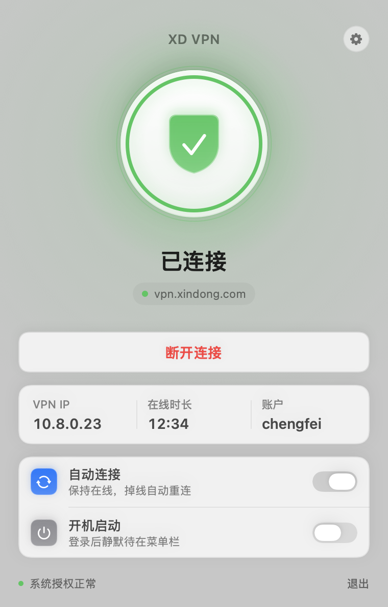
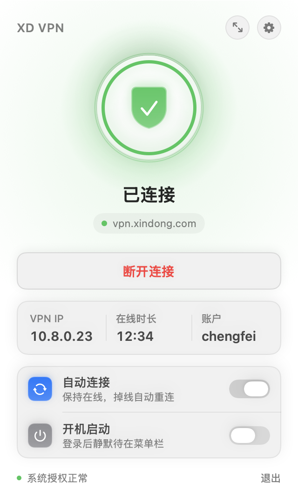

# XD VPN

一个好看一点的 macOS 菜单栏 VPN 客户端，用来替代每天敲密码的 Cisco AnyConnect / `xd-vpn` 脚本。
底层还是 [openconnect](https://www.infradead.org/openconnect/)，只是把“记住账号密码、一键连接、掉线自动重连”做成了一个原生 SwiftUI 应用。

<p align="center">
  <br>
  
  
  
</p>

## 功能

- **主窗口 + 菜单栏**：手动打开应用时显示连接窗口；开机自启时安静地待在菜单栏。菜单栏图标是自绘的盾牌（未连接描边 / 连接中呼吸点 / 已连接勾 / 失败叹号），点开是同一套面板。
- **一个 profile**：服务器、用户名保存在应用配置里，密码只存 macOS 钥匙串。
- **连接 / 断开**：菜单栏图标随状态变化（未连接 / 连接中 / 已连接 / 失败），面板显示 VPN IP 和在线时长。
- **自动连接（保持在线）**：开启后启动即连；隧道断开、网络恢复、系统唤醒都会自动重连（3s → 6s → … → 60s 退避）。
  手动断开会暂停自动重连，点“连接”后恢复，不会和你抢。
- **切 Wi‑Fi / 唤醒立刻恢复**：监听物理网络（en* 的 IP、网关、链路）变化和系统唤醒，一旦网络可用就给 openconnect 发 `SIGUSR2`，
  用原会话 cookie 立即重建隧道（IP 不变、不用重新登录），不必等 30 秒的 DPD 超时。90 秒内恢复不了就自动重新登录。
- **认证失败不重试**：密码错误直接停下来提示，避免把公司账号锁了。
- **证书不受信任时一键信任**：解析 openconnect 给出的 `--servercert pin-sha256:…` 并可以一键采用。
- **开机启动**：登录后静默待在菜单栏。
- **接管孤儿进程**：如果发现已有 openconnect 在跑（脚本启动的或上次应用崩溃留下的），直接接管显示并可断开。
- **日志窗口**：openconnect 的完整输出，方便排查。

## 安装

```bash
brew install openconnect     # 如果还没装
git clone <this repo> && cd vpn_xd_client
make install                 # 编译并拷贝到 /Applications/XD VPN.app
open "/Applications/XD VPN.app"
```

需要 Xcode 26（Swift 5.10+ 工具链）。`make app` 只编译到 `build/`，`make run` 编译并启动。

## 第一次使用

1. 点菜单栏的盾牌图标 → 「开始设置」，填服务器（默认 `vpn.xindong.com:8443`）、用户名、密码，保存。
   之前用过 `xd-vpn` 脚本的话，会出现「从 xd-vpn 脚本导入密码」按钮，可以直接导入钥匙串里已有的密码。
2. 切到「系统授权」→「安装授权…」，输入一次 **macOS 管理员密码**（不是 VPN 密码）。
3. 回到面板点「连接」。想要保持在线就把「自动连接」打开。

> 注意：和脚本一样，XD VPN 在公司办公网络内连不上，只在外网使用。

## 为什么要“系统授权”，它做了什么

`openconnect` 建隧道必须是 root。脚本方案每次 `sudo` 输密码；一个要自动重连的 GUI 应用没法每次弹密码框，所以这里做了一次性授权：

- `/usr/local/libexec/xd-vpn-helper`：root 拥有、0755 的小脚本，只接受 `connect <server> <user> [servercert]` / `disconnect [force]` / `version` 三个命令，参数做了白名单校验，密码通过标准输入传给 openconnect。
- `/etc/sudoers.d/xd-vpn`：`<你的用户名> ALL=(root) NOPASSWD: /usr/local/libexec/xd-vpn-helper`，只对这一个文件免密。

之后应用通过 `sudo -n xd-vpn-helper connect …` 启动 openconnect（前台子进程，实时读它的输出判断状态），`reconnect` 发 SIGUSR2 让它原地重建隧道，`disconnect` 发 SIGINT 结束。
helper 脚本内嵌在应用里；应用升级后如果脚本有变化，「系统授权」页会显示「助手需更新」，再点一次「更新授权助手…」即可（需要管理员密码）。
「系统授权」页里有「移除授权」，会把上面两个文件删掉。

## 掉线 / 重连行为

| 情形 | 行为 |
| --- | --- |
| 切换 Wi‑Fi、插拔网线、IP 变化 | 1.5 秒内检测到，发 SIGUSR2，openconnect 用原会话立刻重连（IP 不变） |
| 睡眠唤醒 | 网络一可用就发 SIGUSR2；面板显示「恢复连接中」 |
| 网络彻底断开再恢复 | 恢复时发 SIGUSR2；期间 openconnect 自己最多重试 60 秒 |
| 服务器踢掉会话 / 进程退出 | 3s → 6s → 12s → … → 60s 退避后重新登录 |
| 「恢复连接中」超过 90 秒 | 放弃原会话，重新登录 |
| 手动点「断开」 | 自动重连暂停，点「连接」后恢复 |
| 密码错误 | 停下并提示，不重试 |

## 设计

遵循 macOS HIG：系统材质（菜单栏面板用系统 popover 材质，主窗口用 `NSVisualEffectView`）、白色半透明模块加发丝线与柔和投影、语义色（系统绿 / 橙 / 红、跟随用户强调色）、SF 字体与原生开关。所有颜色都是语义色，深色模式自动适配。

## 项目结构

```
Sources/XDVPN
├── App/           入口、AppDelegate（退出时断开）、--snapshot / --selftest 开发模式
├── Core/
│   ├── VPNManager.swift         状态机：连接 / 断开 / 自动重连 / 网络变化恢复 / 日志 / 登录项
│   ├── NetworkWatcher.swift     SCDynamicStore 监听物理网络（IP / 网关 / 链路）变化
│   ├── OpenConnectSession.swift openconnect 子进程与逐行输出
│   ├── PrivilegedHelper.swift   内嵌的 root helper 脚本、安装 / 卸载、状态检查
│   ├── Keychain.swift           钥匙串读写
│   └── VPNProfile.swift
└── Views/         StatusPanelView（面板 / 主窗口共用）、ConnectionOrb、Theme、MenuBarIcon、设置窗口
Support/           Info.plist、图标生成脚本、fake-helper.sh（测试用）
```

## 开发

```bash
swift build                                   # 编译
.build/debug/XDVPN --snapshot /tmp/snap        # 把面板各状态渲染成 PNG，不用点菜单栏
XDVPN_FAKE_PIDFILE=/tmp/f.pid \
  .build/debug/XDVPN --selftest Support/fake-helper.sh   # 无 root 冒烟测试状态机
.build/debug/XDVPN --print-helper | bash -n    # 检查内嵌 helper 脚本语法
```

应用是 ad-hoc 签名的。重新编译后第一次读取密码时，钥匙串会弹一次“允许访问”，点「始终允许」即可。
