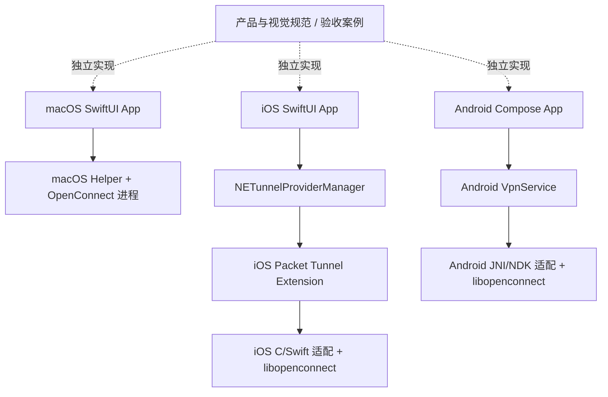

# 多端客户端架构与 iOS 接入方案

日期：2026-09-06。基线：`main@fc9282c`（macOS 1.1.18）。开发分支：`codex/ios-support`。

## 结论与本次落地范围

采用 **同一仓库、三个独立原生客户端、统一产品与视觉规范**。macOS 与 iOS 使用各自的 Swift/SwiftUI 工程，未来 Android 使用 Kotlin/Jetpack Compose；配置模型、权限、状态机、重连、存储和 UI 组件均由各端独立实现。跨端不建立 Swift 共享包，不让 iOS 依赖 macOS 的 `VPNCore`、`VPNModel` 或 UI 代码。

iOS/iPadOS 首版部署目标选择 17.0，macOS 继续 14.0；这是本项目的维护范围选择。Android 的最低版本与 ABI 在启动该端开发时按公司设备分布确定，本次不引入 Android SDK、工程或构建依赖。

同仓库用于一起维护规范和追踪需求，不意味着共同编译、共同发布。允许少量简单逻辑分别实现，以换取权限、生命周期和版本演进的独立性；行为一致性通过规范和验收案例保持，不依赖一个统一跨平台 controller。

已撤回之前的 `Packages/VPNShared` 抽取，并恢复 macOS 的 `Package.swift` 与 `VPNCore/Profile.swift`。当前已在 `Apps/iOS` 实现独立验证版 0.1.0，包含 App、Packet Tunnel Extension、原生引擎适配、On Demand 和诊断入口。**已通过无签名构建，但尚未在公司网关和实体 iPhone 完成连接验证；Android 尚未实现。** 实际交付与限制见 [iOS 验证版说明](../../Apps/iOS/README.md)。

## 1. 独立边界：哪些统一，哪些分开

| 对象 | 跨端约束 | 各端独立实现 |
| --- | --- | --- |
| 配置与校验 | 服务器/账号/认证组的含义、禁止明文落盘凭据、输入边界案例 | Swift/Kotlin 模型、序列化、迁移和本地存储；不强求同一磁盘格式 |
| 状态与操作 | 连接/恢复/失败的用户含义、错误文案原则、手动操作意图 | controller、状态机、错误类型、恢复预算及系统状态映射 |
| 权限 | 清楚说明申请原因、拒绝后可重试、撤销后正确停止 | macOS 助手安装；iOS VPN 配置/Extension；Android VPN 用户授权/Service |
| 凭据 | 脱敏规则、禁止日志保存秘密 | 各平台凭据存储和后台读取政策；不跨设备同步密码 |
| UI | 品牌色、间距层级、卡片/按钮外观、图标含义和信息层级 | macOS/iOS SwiftUI 与 Android Compose 各自组件、导航及可访问性 |
| 诊断 | 指标定义、脱敏规则、验收案例 | 事件采集、落盘、轮转、导出和平台专属字段 |
| VPN 引擎 | 可采用同一 OpenConnect 上游，记录版本/许可证/安全修复 | 各自固定版本、构建参数、TLS 信任、平台补丁与封装 |
| 发布 | 对应平台的验收要求 | 独立版本号、签名、产物和发布节奏 |

原有 `VPNCore` 完整保留在 macOS 范围，名称中的 Core 不代表跨端核心。iOS 新建自己的 profile/controller/日志与证书处理；Android 同样独立。允许参考原实现中的已验证行为，但移植后由目标平台维护和验证，不能通过链接原模块形成依赖。

iOS **内部** App 与 Packet Tunnel Extension 可以共享该 iOS 工程内的配置编码与消息类型；这不建立与 macOS/Android 的依赖。相同原则适用于 Android App 与 VPN Service。不要创建跨平台 `PrivilegeManager`、全局 `VPNStateMachine` 或统一 TUN 对象来隐藏系统差异。

## 2. 仓库组织与依赖

长期目标结构如下；macOS 迁目录和 Android 仍为规划项，iOS 已实现验证工程子集。暂时保留 macOS 现有根目录路径和命令；未来迁移到 `Apps/macOS` 时单独验证路径、打包、测试及开发文档，避免与 iOS 功能混改。

```text
vpn_xd_client/
├── Apps/
│   ├── macOS/                          # 规划：由现有根目录工程单独迁入
│   │   ├── Package.swift
│   │   ├── Sources/                     # XDVPN / XDVPNHelper / VPNCore
│   │   ├── Resources/ / Tests/
│   │   └── scripts/                     # 本端构建、引擎、测试和发布
│   ├── iOS/                            # 已建立：独立验证工程
│   │   ├── XDVPN.xcodeproj
│   │   ├── App/                        # SwiftUI + NETunnelProviderManager
│   │   ├── Common/                     # 仅本端 App/Extension 的消息与配置
│   │   ├── PacketTunnel/               # NE 生命周期、路由/DNS
│   │   ├── OpenConnectAdapter/         # 本端 C/Swift 桥接、packetFlow
│   │   ├── Configuration/ / Tests/
│   │   └── scripts/                     # 本端 XCFramework、构建和签名
│   └── Android/                        # 未来独立工程
│       ├── settings.gradle.kts
│       ├── app/                        # Kotlin/Compose、VpnService、存储
│       ├── native/                     # JNI/NDK、libopenconnect 适配
│       └── scripts/                     # 本端依赖构建与发布
├── specs/                              # 规划：非运行时规范与验收素材
│   ├── product/                        # 术语、状态含义、配置规则与案例
│   └── design/                         # 视觉 token、品牌资源、组件和页面规范
└── docs/design/2026-09-06-ios-support.md # 本文（已落地）
```

现阶段实际目录仍是根目录 `Package.swift`、`Sources/`、`Resources/`、`Tests/`、`scripts/` 和 `docs/`。iOS 工程已在 `Apps/iOS` 建立，Android 启动时在 `Apps/Android` 新建。根目录不出现共享运行时代码包。



图中的 manager 到 provider 是系统控制关系；iOS App 与 Extension 是独立进程。三条平台实现链之间没有 import、链接或构建依赖。iOS App 不链接 OpenConnect，只有 Extension 链接本端引擎。

构建隔离原则：iOS 测试不要求 macOS 助手或 Android SDK；macOS 构建不要求 iOS 签名；Android 构建不要求 Xcode。未来 CI 按平台路径触发，对规范变更运行受影响的验收案例。规范和视觉资源按版本采纳，不因一次 token 更新强制三端一起发布。若将来有配置导入/服务端 API，再单独定义版本化交换格式，当前不预建跨端数据同步层。

OpenConnect 是共同的第三方来源，不是我们自建的共享客户端核心。各端可暂时使用不同的已验证版本；安全修复统一跟踪、各端分别验收。初期不提取共用 C wrapper，等两个移动端实际验证出稳定交集后再评估，且不把它作为上线前提。

## 3. OpenConnect 支持程度

| 项目 | 依据与判断 | iOS 首版范围 |
| --- | --- | --- |
| AnyConnect 协议 | 上游实现已存在；当前 macOS 使用 9.21 | 沿用该协议，仍须验证公司网关对移动端策略与认证的要求 |
| 用户名/密码/认证组 | libopenconnect 认证表单回调可接入 | 只自动填已知字段；未知挑战明确报错，不反复提交密码 |
| CSTP/TLS、DTLS | 库有 CSTP 建连、DTLS 初始化和 mainloop API | 先验证 TLS 数据通路，再验证 DTLS 与 UDP 不可达时回退 |
| iOS 引擎集成 | 库可接收外部 TUN fd；公开 packetFlow 提供包接口 | 需要我们实现桥接和交叉构建，尚未真机验证 |
| 系统路由/DNS | OpenConnect 可读取服务器分配信息 | 映射到 NE 设置，不执行 vpnc-script |
| SAML/SSO/MFA、客户端证书 | 协议/服务端相关，并非所有流程都等价 | 不纳入首版；后续分别设计前台认证及凭据交接 |
| CSD/HostScan、终端合规检测 | 不能照搬桌面可执行程序/脚本 | 首版不支持；若公司网关强制要求，则属于接入阻塞项 |
| 自动恢复 | C 库有控制管道及恢复机制 | 需适配 Extension 生命周期和 Wi-Fi/蜂窝切换 |
| 官方现成 iOS SDK | 本次核查未找到可直接集成且由上游承诺支持的完整 SDK | 按自行维护适配层估算，不能按“换 target 即完成”估算 |

上游列明 AnyConnect 等协议，但明确不是 Cisco 官方支持的实现。[OpenConnect 官方说明](https://www.infradead.org/openconnect/)

`--os=apple-ios` 是向服务器报告客户端操作系统的选项，不证明库已完成 iOS 数据通路适配。是否设置需在公司网关上验证，不用它绕过终端合规要求。[OpenConnect 手册](https://www.infradead.org/openconnect/manual.html)

库接口见 [上游 openconnect.h](https://gitlab.com/openconnect/openconnect/-/blob/v9.21/openconnect.h)。本次另核对了现有构建缓存中的 **9.21** `openconnect.h`、`tun.c`、`script.c`、`configure.ac`；不以浮动 master 代替实际打包版本。2015 年的 [上游 iOS 讨论](https://lists.infradead.org/pipermail/openconnect-devel/2015-July/003089.html) 仅是历史背景，不能作为当前可用性证明。

### 3.1 数据包桥接：首个技术验证重点

首选验证 **`packetFlow` + 非阻塞 `socketpair(AF_UNIX, SOCK_DGRAM)` + `openconnect_setup_tun_fd()`**：每个 datagram 对应一个 IP 包，保留包边界；不使用未经封帧的 stream socket。

```text
系统 IP 包 → packetFlow.readPackets
          → 桥接：地址族头 + IP 包 → socketpair
          → libopenconnect 加密 → TLS/DTLS → VPN 网关
系统 IP 包 ← packetFlow.writePackets
          ← 桥接：校验并移除地址族头 ← socketpair
          ← libopenconnect 解密 ← TLS/DTLS ← VPN 网关
```

这是待验证的实现选择。9.21 `tun.c` 在 Apple 分支使用 **4 字节网络字节序 AF 前缀**；Apple `readPackets` 返回的 protocol 数值为主机字节序。桥接须显式转换 `AF_INET/AF_INET6`，检查头与 IP 版本、包长和 MTU，禁止盲目拼接。在桥接中添加有界队列、背压与丢包计数，处理 `EAGAIN` 和停止竞态；不要让高吞吐占满 Extension 内存。[Apple packetFlow 接口](https://developer.apple.com/documentation/networkextension/nepackettunnelflow/readpackets(completionhandler:))

不要通过 KVC 访问 `packetFlow.socket.fileDescriptor` 等私有实现。也不要用 `openconnect_setup_tun_script()`：该路径会创建子进程。`setup_tun_fd` 本身不负责路由/DNS，设置必须由 NE 完成。

PoC 必须确认所有建连、恢复和停止路径均不触发 `fork`、脚本或 `/dev/tun` 创建。上游 macOS 库包含这些代码；仅“不调用 CLI”不足以完成 iOS 适配审计。若现成 fd 模式无法满足 extension-safe 构建，则维护最小、可复现的 iOS TUN/脚本适配补丁，不在 Swift 层访问库私有结构体字段。

### 3.2 构建与 TLS

- 以当前固定的 OpenConnect 9.21、OpenSSL 3.6.2 为初始对照基线；iOS 独立固定版本和摘要，建立本端 toolchain、patch 和构建缓存。不是默认认为这些版本已通过 iOS 验证。
- 为真机 `arm64-apple-ios`、模拟器 `arm64-apple-ios-simulator` 编译不同产物；如需支持 Intel 开发机，再加入 x86_64 simulator。同为 arm64 也不能混用 macOS/iOS/simulator 对象。
- 验证版先按 SDK 使用独立静态库与头文件；后续依赖交付可生成包含头文件/module map 的静态 XCFramework。显式指定 SDK、deployment target、extension-safe 编译与链接检查。盘点全部依赖（包括实际配置中的 libxml2/zlib），关闭桌面外部认证、代理发现、硬件令牌等未用路径。
- 保留 SHA-256 固定下载、补丁、构建参数、来源许可证与可重建材料；检查最终 Mach-O 的平台、架构、最低版本、动态依赖及禁用 API。
- **iOS 不使用 `/etc/ssl/cert.pem`**。PoC 可用随包维护的受信 CA bundle，并保留主机名、有效期和链验证；生产实现优先评估完整证书链交给 `SecTrust` 的系统信任适配。不能把失败回调改成恒成功，也不能假定 OpenSSL 自动使用 iOS 钥匙串中的企业根证书。
- 企业私有 CA、客户端证书、服务器证书轮换策略单独验收；当前 macOS 的 TLS 配置不能直接作为 iOS 的信任配置。

## 4. iOS 连接控制与生命周期

App 使用 `NETunnelProviderManager` 加载本应用的 provider 配置、保存并重新加载后启动隧道；按 provider bundle ID 查找已有配置，避免每次启动创建重复 VPN。订阅系统连接状态，App 回到前台重新读取；Extension 的版本化状态消息补充地址/阶段/错误，不以 UI 内存里的 bool 代表连接状态。

Extension 的启动次序：读取并验证配置/凭据 → libopenconnect 认证 → CSTP 建连 → 获取分配地址、路由、DNS/MTU → `setTunnelNetworkSettings` 成功 → 数据泵就绪 → start completion 成功。DTLS 可随后建立，TLS 通路可用时不必阻塞等待 DTLS。启动和停止 completion 各只完成一次，超时/取消走同一清理路径。[Apple 启动契约](https://developer.apple.com/documentation/networkextension/nepackettunnelprovider/starttunnel(options:completionhandler:))

路由、IPv4/IPv6、包含/排除网段、DNS 和 MTU 通过 `NEPacketTunnelNetworkSettings` 提交。服务端下发内容先验证；分流 DNS 与全隧道 DNS 明确区分。不能静默忽略 IPv6 或必需的代理配置后声称公司策略已完整生效。配置清理使用 NE 生命周期和 `setTunnelNetworkSettings(nil)` 等公开机制，不执行系统 route/scutil 命令。[Apple 网络设置接口](https://developer.apple.com/documentation/networkextension/netunnelprovider/settunnelnetworksettings(_:completionhandler:))

首个 PoC 可限定 IPv4 分流，但正式 MVP 必须显式定义并验证 IPv6/双栈、IPv6-only/NAT64 的行为。全隧道需验证外层 VPN socket 不被捕获回隧道、网关 DNS/多地址切换、IPv6 不发生策略外泄漏；不能只添加 IPv4 默认路由就标记为“全流量保护”。公司办公首版默认尊重网关分流策略，不自行开启全局拦截。

libopenconnect 阻塞调用和 mainloop 放独立 worker；通过 command pipe 取消或暂停，等待 worker 结束后才 free C 会话与关闭桥接 fd。fd 的所有权明确且只关闭一次。stop、start 失败、网络变更、系统撤销 VPN 均需幂等。不向 iOS 进程发送 macOS 的 SIGUSR2，不照搬现有 3 秒清理/重登预算；先测蜂窝网络耗时后确定预算。

App 退后台、关闭页面不会主动断开；系统负责 Extension 的运行与终止，不能承诺它永不被回收。Extension 监听可用网络变化、合并通知并恢复；UI 不依赖前台 timer 保活。日志中的“未正常退出”不能直接沿用 macOS 告警，因为移动端系统终止具有不同语义。

### Auto Connect 的产品语义

根据新增的锁屏恢复需求，首版目标调整为“用户启用自动连接后，符合规则且认证条件允许时，无需打开 VPN App 即可恢复业务访问”。拆分为运行中 Extension 的会话恢复，以及 Extension 退出后的系统条件触发；只实现 App 启动时重连不满足该目标。

**VPN On Demand 的可行性验证提前到 P1**，P2 完善用户开关和说明。它由系统条件规则触发，不保证每次解锁立刻连接，也不等同于受监督设备的 IKEv2 Always On。手动断开须先保存禁用有效 On Demand 规则、核验成功后再停止隧道，保留独立偏好/暂停标记；重新启用必须有明确用户动作，不因 App 重启自动撤销暂停。认证/证书错误须停止无效自动尝试，并验证跨 Extension 重启不会反复提交凭据。公司网关若要求交互认证，明确等待用户，不承诺无人值守恢复。[Apple On Demand 规则](https://developer.apple.com/documentation/networkextension/neondemandrule)

网络恢复采用 iOS 独立的串行协调器，合并路径事件并结合真实 socket/协议错误判断；用连接代次忽略过期回调，区分等待网络、恢复传输、恢复认证和需要人工登录。优先续用有效会话，不将每次换网都实现为密码重登。设计依据、Cisco/Hillstone 证据边界及真机矩阵见 [移动端 VPN 可靠性调研](2026-09-06-ios-vpn-reliability-research.md)。

### 配置、凭据和日志

普通配置使用版本化 provider configuration，只放非敏感字段；密码使用共享 Keychain access group 的持久引用，由 Extension 读取。App Group 用于共享非敏感快照和日志，不能替代 Keychain 共享权限，也不存放密码/Cookie。

需要锁屏后重连的凭据选择 `kSecAttrAccessibleAfterFirstUnlockThisDeviceOnly`，并说明重启后首次解锁前不可用；它比 macOS 当前的 WhenUnlocked 政策允许更多后台访问，是明确的平台差异。若组织要求每次用户认证，则无法同时承诺无人值守后台重登。[Apple Keychain 可访问性](https://developer.apple.com/documentation/security/ksecattraccessibleafterfirstunlockthisdeviceonly)

App 与 Extension 分别写有上限的脱敏日志，事件用 connection ID、时间、来源、错误类别合并。仅传递有界状态快照；日志无密码、Cookie、Token、认证正文，导出由系统分享面板完成。诊断用统一日志/设备日志，不能用 macOS 文件路径说明指引 iOS 用户。

## 5. Android 后续接入

建议选择 **Kotlin + Jetpack Compose + VpnService + JNI/NDK libopenconnect**。这是未来端的实现路线，不把 Android 提前做成 iOS 开发的依赖。Compose 可以实现自己的品牌主题和组件，不要求沿用默认 Material 外观。[Android 自定义设计系统](https://developer.android.com/develop/ui/compose/designsystems/custom)

Android 系统提供 `VpnService.prepare()` 授权入口、`VpnService.Builder` 的地址/路由/DNS 配置，以及 `establish()` 返回的 TUN `ParcelFileDescriptor`；需用 `protect()` 排除外层 VPN socket，避免流量绕回自己的隧道。服务需处理前台运行、通知与 `onRevoke()`，不能照搬 iOS Extension 生命周期。[Android VPN 开发指南](https://developer.android.com/develop/connectivity/vpn)

本项目拟将 TUN fd 通过 JNI 接入 Android 编译的 libopenconnect，C 引擎创建或重建外层 TLS/DTLS socket 时调用本端 protect 适配并核验结果。明确 JNI 的 fd 转移/复制和关闭所有权；不要复制 Apple TUN 的 AF 前缀处理。NDK 构建、证书信任、网络切换、后台限制与厂商省电行为均须在 Android 真机单独验证。

| 能力 | macOS 当前实现 | iOS 方案 | Android 方案 |
| --- | --- | --- | --- |
| 系统授权 | 安装/升级/移除权限助手，管理员确认 | 保存系统 VPN 配置及 Network Extension 签名能力 | `prepare()` 请求 VPN 授权，Service 受系统绑定权限保护 |
| 隧道运行 | 助手启动 OpenConnect 子进程 | 系统托管 Packet Tunnel Extension | VpnService 配合本端原生引擎 |
| 网络配置 | helper/脚本及 macOS 清理校验 | NE 网络设置 | VpnService.Builder/TUN fd |
| 用户撤销 | 助手移除、通道结束等本端处理 | 系统停止/删除 VPN 配置 | `onRevoke()` 等服务生命周期处理 |
| 后台与状态 | 菜单栏与助手会话 | Extension 与系统 VPN 状态 | Service 与系统通知 |
| 自动连接 | 本端启动偏好与重连 | Extension 恢复 + 系统 On Demand（P1 验证） | App 偏好；系统 Always-on/Lockdown 独立阶段 |

Android 每次连接前重新检查授权，不能把上次授权结果永久缓存。Always-on/Lockdown 由系统或设备管理策略控制，若阻止应用内断开，UI 必须解释原因并给出合适入口；不能用统一的“断开按钮一定可用”规则覆盖。iOS 的 On Demand、Android 的 Always-on 和 macOS 当前 Auto Connect 不声明等价。[VpnService API](https://developer.android.com/reference/android/net/VpnService)

最低系统、目标 SDK、前台服务声明、分发政策及 ABI 在 Android 开工和发布时按官方要求重新核查；当前仅确定架构边界。Android 的实现与验收排在 iOS 基础数据通路验证后，不扩展本次交付范围。

## 6. UI 风格统一，组件各端实现

macOS/iOS 分别用 SwiftUI，Android 用 Compose。以同一设计规范保持品牌和信息层级一致，各端独立实现 UI；当前不引入跨端 UI 框架或 `VPNUI` 包。系统授权弹窗、系统 VPN 设置、分享面板等保持原生体验。

| 界面 | iPhone 紧凑宽度 | iPad 常规宽度 | macOS |
| --- | --- | --- | --- |
| 导航 | TabView：连接 / 诊断 / 设置 | NavigationSplitView：相同目的地 | 保留现有侧栏和菜单栏 |
| 连接页 | 单列状态卡、主按钮、服务器/IP/时长、自动连接 | 宽度足够时状态与详情双列 | 保留桌面布局 |
| 配置 | 设置内 Form，服务器/用户名/密码/认证组 | 详情区域 Form | 现有配置页 |
| 权限 | 首次连接时系统添加 VPN 配置提示；失败提供说明 | 同 iPhone | 独立系统助手授权页 |
| 质量与日志 | 诊断页的摘要和日志详情，可分享 | 摘要与列表自适应排列 | 现有质量/日志页 |

```text
┌────────────────────────┐
│ XD VPN                 │
│ 工作网络                │
│ ┌────────────────────┐ │
│ │ 盾牌  尚未连接      │ │
│ │ 工作网络，一键就绪。 │ │
│ │ [    连接 VPN    ] │ │
│ └────────────────────┘ │
│ 服务器  vpn.…          │
│ 地址    —    时长  —   │
│ 自动连接          ○    │
│                        │
│  连接    诊断    设置   │
└────────────────────────┘
```

保留深绿/薄荷色品牌，但将颜色改成语义 token；iOS 跟随系统深浅色。移除桌面 `minWidth: 990`、固定大字号和强制浅色。使用系统文字样式、Dynamic Type、至少 44 pt 可操作区域，表单允许滚动并处理键盘；iPad 分屏按实际宽度降为单列，不能只按设备型号判断。

各端自己的组件接收本端展示值和 action，不引用其他客户端的 model。即使 macOS/iOS 都使用 SwiftUI，也分别维护组件。复制/分享等动作在本端完成。状态同时使用文字、图标和颜色；VoiceOver 读出状态、按钮动作与错误，连接中保留取消入口。质量尚无样本时显示“—”，不能生成示例指标冒充实测。


统一设计规范应覆盖：

| 规范层 | 统一内容 | 本端适配 |
| --- | --- | --- |
| 品牌 | Logo、深绿主色、薄荷强调色、图标语义 | SF Symbols/Android 图标使用含义一致的本端资源，不把平台受限资源直接打包到另一端 |
| 颜色 token | `brand.primary`、`surface.canvas`、`text.primary`、`status.error` 等语义 | 初始浅色主色参考现有 `#227858`、画布 `#F6F7F3`；深色值独立定义并验证对比度 |
| 排版与间距 | 标题/正文/辅助文字层级、4/8/12/16/24/32 间距级别 | 字体采用系统字体，pt/dp/sp 按平台使用；支持动态字体与缩放 |
| 组件外观 | 状态卡、主/次按钮、输入框、错误提示的视觉层级 | 分别实现 SwiftUI/Compose 组件；建议 iOS 触控区至少 44 pt、Android 至少 48 dp |
| 页面信息 | 当前状态、连接动作、服务器/IP/时长、错误恢复入口 | 桌面侧栏/菜单栏；手机底部导航；平板按宽度布局 |
| 交互状态 | 未配置、连接中、已连接、恢复中、失败、无样本的设计示例 | 平台权限流程、系统策略导致的不可用动作分别说明 |

未来 `specs/design` 可用 JSON 记录 token、附品牌资源和状态示例，各端在开发时映射到自己的 Theme。先维护规范和本端映射，不引入生成器、运行时下载或三端共用组件库。颜色和文案统一不能替代权限/后台行为的准确说明。

## 7. iOS 签名、分发与依赖交付

需要实际 Apple Developer Team、两个 bundle ID（App/Extension）、Network Extensions capability、App Group 和 Keychain access group。Extension 使用 `com.apple.networkextension.packet-tunnel` extension point 和 `packet-tunnel-provider` entitlement，由 App 嵌入并正确签名。具体 Team/标识在签名阶段配置，不把个人 Team 写死进共享代码。[Apple Extension 配置](https://developer.apple.com/documentation/networkextension/nepackettunnelprovider)

开发期先做真机开发签名验收；再根据公司已有渠道选择 TestFlight、Custom Apps/MDM 或符合资格的企业内部分发。模拟器用于 UI 和纯逻辑，不能代替真实 VPN、锁屏和蜂窝切换验收。Apple 当前 App Review 5.4 对提供 VPN 服务的 App 要求组织开发者、隐私说明及适用地区许可信息；分发渠道必须单独确认，不能承诺所有渠道都可上架。[Apple 审核指南 5.4](https://developer.apple.com/app-store/review/guidelines/#vpn-apps)

OpenConnect 为 LGPL 2.1。静态集成需按实际分发方式准备对应源码、修改、许可证及允许用户重新链接所需材料；不能仅复制现有 macOS ZIP 的许可证目录就视为完成 iOS 交付。App Store 分发条款与具体依赖组合需在发布前评估，这不阻塞本地架构开发。[OpenConnect 许可证](https://www.infradead.org/openconnect/licence.html)

## 8. 实施顺序与验收门槛

| 阶段 | 交付 | 完成标准 |
| --- | --- | --- |
| P0：平台边界（本次） | 多端架构决策、撤回跨端代码依赖、统一视觉规范方向 | macOS 源码和包清单恢复基线；方案无跨端运行时依赖 |
| P1：真机技术验证 | 独立 iOS 工程、C 构建、包桥接、最小状态页与 On Demand 验证 | 公司网关真实内网/DNS 可用；验证锁屏/换网及 Extension 冷启动恢复、停止后网络恢复 |
| P2：可用 MVP | 完整 SwiftUI、Keychain、配置保存、自动连接开关、恢复和日志 | 退后台/锁屏、Wi-Fi↔蜂窝、断网重试、手动断开、凭据错误及配置更新正确 |
| P3：内部交付 | 分发签名、依赖材料、验证报告 | 真机验收通过并获得目标渠道发布条件；发布是单独动作 |
| 后续按需 | 独立 Android 客户端、SSO/MFA | Android 复用规范并独立验证；各项不绑进 iOS 首版 |

P1 优先验证 extension-safe C 构建、数据包路径、证书信任、公司网关移动端策略，以及不打开 VPN App 的锁屏/换网恢复。不要在这些未通过之前承诺上线日期。

必要验证矩阵：

- **规范一致性**：配置含义、非法输入、用户操作、脱敏与指标案例在各端分别验收；检查平台差异有准确提示。
- **平台回归**：修改哪个客户端就运行该端必需测试；macOS 迁目录或改源码时跑其完整测试与打包检查，纯 iOS 开发不要求运行 macOS 助手。
- **桥接/生命周期**：IPv4/IPv6 前缀、MTU 边界、满队列、重复停止、认证中取消、设置失败、C 回调晚到、内存与 fd 泄漏。
- **网络/安全**：分流与全隧道策略分别测，DNS 内外域名、UDP 被阻断、证书过期/错主机名/未知 CA、IPv6-only/NAT64、网关地址变化。
- **真实设备**：最低支持系统与当前系统、锁屏/解锁、重启首次解锁、App 被系统终止、Extension 被终止、Wi-Fi/蜂窝切换、认证页网络及长时间负载。
- **UI**：小屏 iPhone、iPad 分屏、深色、大号文字、VoiceOver；无密码/无日志/无指标状态。

真实网关验收需要测试账号与公司允许的接入窗口，真机安装需要匹配签名。以上仅阻塞相应验收，不影响独立 iOS 工程、UI、构建与模拟环境开发。

## 9. 本次修订验证记录

- 对比确认 iOS worktree 的 `Package.swift`、`Sources/VPNCore/Profile.swift` 与 `main@fc9282c` 对应文件逐字节一致；移除本任务新增的共享包源文件，macOS 不再存在新增的共享包依赖。
- 平台边界修订时工作区仅改 README 和方案；后续新增的验证版全部位于 `Apps/iOS`，根目录 macOS 源码与构建脚本未改。独立检查主 worktree 状态，不写入主线正在进行的其他工作。
- 检查文档目录、依赖图、阶段计划与 README 均遵循“独立客户端、统一规范”，并运行 `git diff --check`。
- 上轮的 174 项 macOS 测试和打包检查是在已撤回的共享包方案上通过，不能作为本轮 iOS/Android 实现的验证。共享包的 iOS 编译检查也已随包撤回，不再提供对应命令。
- 平台边界修订未重复运行无关的 macOS 测试。后续 iOS 验证版已完成独立引擎、App/Extension 编译及本地验证，记录见 iOS README；真实手机 VPN 验收仍未完成，Android 尚未实现。

## 10. 验证版 0.1.0 实现状态

2026-09-06 已完成独立 iOS 工程、SwiftUI 连接/设置/诊断、共享 Keychain 持久引用、SecTrust 验证、packetFlow 数据桥接和串行 C worker。OpenConnect 内部采用 90 秒会话恢复窗口、2 秒起步的上游递增间隔；额外冷启动受五分钟三次的持久化预算约束，尚未实现完整自定义指数退避。

P1 仍待真机验收，不能标为完成。IPv4/IPv6、路由、DNS 与 MTU 已实现校验，但单地址族全隧道、PAC、SSO/MFA 和客户端证书会明确拒绝。On Demand 规则保存和恢复门禁已实现，需验证公司域名/认证策略及系统拉起行为。具体构建、安装、已通过检查和剩余矩阵以 [验证版说明](../../Apps/iOS/README.md) 为准。
