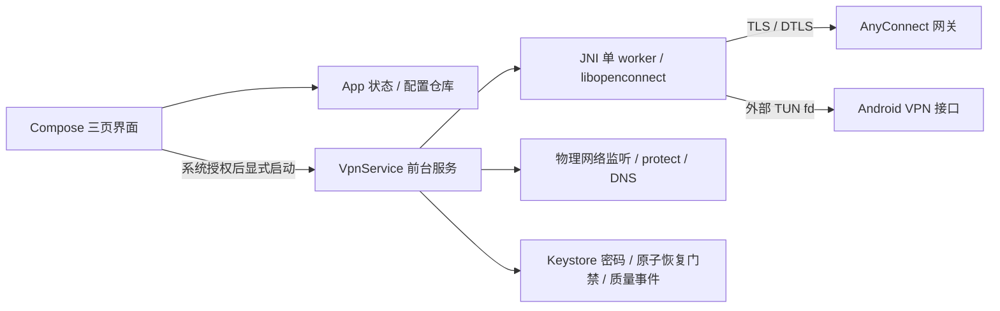

# Android 接入技术方案与实施验收

日期：2026-09-07；基线：main@d162185；分支：codex/android-support。

## 决策

在 Apps/Android 建立独立 Kotlin / Jetpack Compose 工程。Android 9（API 28）起，compile/target API 36；先交付 arm64-v8a 真机和 x86_64 模拟器两种 ABI。现有 macOS/iOS 构建与运行时代码不做跨端抽取。UI、产品含义和验收场景参照 main 中的 iOS 0.1；Android 独立版本 0.1.0。

选择原生 VpnService + JNI + libopenconnect，复用已验证的 AnyConnect 协议而非自行实现 TLS/DTLS。NDK r28c（28.2.13676358），OpenConnect 9.21 / OpenSSL 3.6.2 与 iOS 固定版本对齐，libxml2 2.15.4。源码逐包校验 SHA-256，不下载第三方 APK 或使用其他客户端的二进制。Gradle 8.13 / AGP 8.10.0 / Kotlin 2.1.20 / Compose BOM 2025.05.01 固定兼容组合；依赖升级独立验收。

## 产品与 UI 对齐

| iOS 行为 | Android 交付行为 |
| --- | --- |
| 连接 / 设置 / 连接质量三个页签 | Compose NavigationBar；白色圆角卡片、浅灰背景、品牌绿 #227858，深色主题及字体缩放 |
| 未连接盾牌、连接中蓝色旋转圆弧、成功绿色盾牌 | 原生 Canvas 与矢量图标；状态文字可读，48dp 触控区域 |
| HTTPS 服务器、用户名、密码；密码留空保留旧值 | 默认同公司地址；输入校验；连接中锁定配置；保存不会连接 |
| 首页自动连接仅保存偏好 | 开关不发起连接；点击连接后才授权本轮恢复，手动断开持久化取消；重开 App 不连接 |
| 当前连接时长、传输协议、自动恢复状态 | Service 提供真实状态；只在 UI 前台刷新展示计时 |
| 最近24小时恢复成功/失败、最近恢复耗时、建议 | 有界事件历史2048条；配对事件去重；取消不算失败；单调时钟与设备启动标识 |
| 详细事件、真实包计数、分享报告 | 最近64条脱敏事件；OpenConnect stats；Android 系统分享纯文本，不包含账号/地址/原始日志 |
| 默认 IPv4 全隧道、DTLS 优先/TLS 回退 | 服务端配置转 VpnService.Builder；不暴露高级路由开关；无 IPv6 地址时保持 Android 默认阻断 IPv6 |

与当前 iOS 相同，首版范围是用户名/密码 AnyConnect。不支持 SSO/MFA、客户端证书、HostScan/CSD、PAC、IPv6-only 和全隧道显式排除路由。服务器要求不支持的表单或网络配置时解释失败，不静默降级。旧 iOS 配置迁移属于 iOS 本地行为，Android 不导入钥匙串或历史配置。

## 架构与生命周期

- VpnService 是连接的唯一所有者，与 Activity 同应用进程但不依赖 Activity 生命周期。主线程处理 Intent/界面；一个后台 worker 独占 C 会话。控制线程只能写命令管道；销毁必须等 worker 退出，避免 fd/指针复用竞争。
- 每次连接先 VpnService.prepare，授权拒绝不启动服务、不消耗认证预算。立即发布前台通知，Android 14+ 使用已获 VPN 授权适用的 systemExempted 类型。通知提供断开动作；onRevoke 与手动断开进入相同清理链。
- ConnectivityManager 只监听 NOT_VPN 物理网络。TLS/DTLS 每个新 socket 都必须 protect 并绑定选定物理 Network，失败即关闭该 socket；网关 DNS 也绑定同一物理网络。换网短暂合并后暂停原生 mainloop、刷新解析并使用原 cookie 恢复；不 bindProcessToNetwork，避免整个 App 意外绕过 VPN。
- Android TUN 已提供原始 IP 包，直接交给 OpenConnect，不复制 iOS packetFlow 的 socketpair/AF 前缀。Builder 接受经过数量、地址、掩码、MTU 校验的服务端设置；不调用 allowBypass，不排除自身应用。服务端更改设置时替换 TUN，并由原生 worker 关闭旧 fd。
- 引擎内恢复最长90秒；需要新认证时先持久化五分钟最多三次预算。账号认证拒绝、证书失败、配置错误持久化暂停；成功拿到 cookie 后的 CONNECT 401视为会话过期，在预算内换 cookie。用户手动重试才能清理暂停。离线等网络，不循环提交密码。
- 自动连接偏好与用户本轮连接意图分开保存。关闭偏好不主动断开；手动断开/系统撤销先清理意图，再取消引擎。系统进程重建只有偏好开启、仍有意图、预算许可才恢复。START_STICKY 不能保证 OEM 后台保活或被强制停止后的复活。
- 不支持 Android 系统 Always-on / lockdown 模式并在 manifest 显式关闭：该模式由系统控制断开，和当前 iOS 对齐的手动断开语义冲突。如需企业强制 Always-on，应独立设计受管模式；不假装应用开关等同系统 Always-on。不使用 WorkManager、精确闹钟、后台 Activity 拉起或无限唤醒锁维持隧道。

## 安全与最佳实践

- OpenSSL 不加载独立根证书库，所有服务端证书链交给 Android X509TrustManagerExtensions 校验；同时用 OpenSSL X509_check_host / X509_check_ip_asc 检查当前 URL 的 DNS 名（含合法重定向）。信任 system 与用户安装 CA，便于企业 CA；无跳过错误开关，禁止明文 HTTP。
- 密码由 AndroidKeyStore 不可导出 AES-256-GCM 密钥加密，随机 IV，应用私有、首次解锁后可读的 credential-protected 存储。关闭备份和设备迁移；不写 Intent、SavedStateHandle、日志/剪贴板；错误消息用固定分类，密码认证每会话只提交一次。
- 诊断仅保存允许枚举事件和计数，不格式化 OpenConnect 原始日志。历史轮转有界、原子写入；损坏提示不完整。恢复耗时仅同一次设备启动内用 elapsedRealtime 计算，跨重启不估算。
- JNI 动态库可重链接，NDK r28 生成16KB对齐 ELF，AGP 对 APK native entries 对齐；CI 校验 ABI 和16KB对齐。依赖源码、补丁、许可证和构建步骤作为后续分发配套；发布签名由私有配置/CI secrets注入，禁止提交。

## 实施顺序与验收门槛

1. 固化本方案和 iOS 功能矩阵，建立独立 Gradle/NDK 工程。
2. 实现配置/安全存储、恢复策略、网络规划和质量统计，并执行边界回归。
3. 接通真实 JNI 引擎、系统证书、VpnService、物理换网与取消回收。
4. Compose 三页功能和状态绑定，接通系统授权、通知和报告分享。
5. JVM 测试、原生构建、debug APK、lint、模拟器安装与 UI/权限/取消验证；补充 CI。
6. 真机使用本人授权测试账号验证内网业务、Wi-Fi/蜂窝、飞行模式、锁屏5/30分钟/隔夜、DTLS/TLS回退、错误密码/证书、CONNECT401、进程重建、手动断开后网络与不自动重连。

构建和模拟器检查不等于真实网关验收。具体执行结果写入 Apps/Android/VERIFICATION.md；发布安装包在完整实机矩阵和渠道签名完成前只作为开发验证版本。

## 依据

- [Android VPN 指南](https://developer.android.com/develop/connectivity/vpn)：VpnService、系统授权、protect、前台生命周期和 Always-on 差异。
- [前台服务类型](https://developer.android.com/develop/background-work/services/fgs/service-types)：systemExempted 对已配置 VPN 的适用条件。
- [16KB 页面兼容](https://developer.android.com/guide/practices/page-sizes)：NDK/AGP 构建及产物验证。
- [Android Keystore](https://developer.android.com/privacy-and-security/keystore)、[网络安全配置](https://developer.android.com/privacy-and-security/security-config)：设备密钥和企业 CA 信任边界。
- [AGP8.10兼容表](https://developer.android.com/build/releases/agp-8-10-0-release-notes)、[Compose BOM](https://developer.android.com/develop/ui/compose/bom)：固定工具链组合。
- [OpenConnect库与发行](https://www.infradead.org/openconnect/download.html)、[NDK发行](https://github.com/android/ndk/releases)、[libxml2发行校验和](https://download.gnome.org/sources/libxml2/2.15/libxml2-2.15.4.sha256sum)。JNI细节以仓库固定的9.21公开头文件/源码为准。
