# XD VPN 完整技术方案

> 权限架构更新：本文的 sudoers／socket 安装流程记录旧版实现。当前分支迁移为 SMAppService／XPC，具体边界和验证见 [ServiceManagement 迁移设计](design/2026-09-07-service-management-xpc.md)。


原生 macOS 办公 VPN 客户端 · 架构、交互、连接恢复与网络清理

| 文档项 | 基线 |
| --- | --- |
| 方案版本 | 1.0 · 2026-09-06 |
| 主体实现基线 | XD VPN 1.1.8，Build 11；第 01-18 章 |
| 增量实现 | 1.1.9 / Build 12 的连接质量功能见第 19 章；并行开发中的助手 v5 见第 20 章 |
| 系统助手协议要求 | 主体基线为 4；开发快照中的 PrivilegePolicy 已改为 5，不能混用验证结论 |
| 代码基线 | `09c6f3f3bf5e1e46488bd61ad4bc6e3bd98434f8` |
| 运行环境 | macOS 14+；当前交付为 Apple Silicon |
| 文档性质 | 对现有实现的完整技术归纳，另列限制与后续建议 |
| 核验方式 | 阅读基线生产源码、测试与设计记录；首次核对 31 个文件摘要及 124 项历史测试结果；补读并行开发快照 |
| 增量观察截点 | 2026-09-06 10:26:14 +08:00；后续并行修改不自动纳入本文 |

本文中的“已实现”表示代码中存在对应机制，“已有测试记录”表示仓库保存了验证证据，“待验收”表示仍需真实网络或分发环境验证。本次编写未重新运行应用测试、启动 VPN、读取真实凭据或变更系统网络。所有图形均由代码归纳绘制；UI 图为结构示意，不是运行截图。时间图展示策略参数，不代表实测性能。

**版本阅读约定：第 01-18 章中的“当前”均指 1.1.8 / 助手 v4 基线。** 编写期间其他开发工作继续修改了项目，因此第 19-20 章专门归纳新出现的质量监控、路由管理和助手诊断设计。原有 124 项结果及 31 个摘要的一致性是在本次首次检查时确认，不能用于证明最后工作区的新增代码已通过相同验证。1.1.9 验证记录声明保持助手 v4，而观察截点的 PrivilegePolicy 已变为 v5；本文保留这一并行开发边界，不将二者合并描述为同一个已验收构建。

## 01 目标、场景与范围

### 1.1 要解决的问题

XD VPN 面向日常办公：用户保存一次公司 VPN 配置，完成一次系统助手安装，之后从主窗口或菜单栏连接工作网络。产品把认证、提权、连接恢复和异常清理的复杂性收敛在后台，同时保留清晰状态和可操作错误。

开发中的核心困难来自生命周期，而不只是启动 OpenConnect：用户可能在授权尚未完成时取消，在首次登录时切网，在已连接后关闭 Wi-Fi，在恢复过程中退出应用，也可能在旧助手尚未清理完成时打开新版本。方案必须让“用户意图、UI 状态、进程状态、系统网络状态”保持可解释的关系。

### 1.2 功能与非目标

| 维度 | 当前实现 | 明确边界 |
| --- | --- | --- |
| 连接 | Cisco AnyConnect 协议的用户名、密码、可选认证组 | 不提供协议选择器 |
| 配置 | 单个 profile，支持服务器端口与路径 | 不支持多配置切换、导入导出或团队下发 |
| 日常使用 | 主窗口、菜单栏、连接地址、连接时长 | 不展示吞吐、延迟或流量统计 |
| 自动化 | 启动时连接、掉线重试、切网及唤醒恢复 | Auto Connect 不等于开机启动；没有登录启动开关 |
| 认证 | 本机钥匙串保存密码，正常验证服务器证书 | 不支持交互式 MFA、浏览器 SSO、设备证书、CSD/HostScan |
| 运维 | 授权安装、升级、修复、移除；本地滚动日志 | 没有云端遥测、远程控制或自动更新 |
| 网络 | OpenConnect 与 vpnc-script 承担实际隧道配置 | 未实现 Network Extension、Kill Switch 或自定义分流管理 |

### 1.3 五项设计原则

1. **日常操作轻量。** 设置与授权放在独立页面，常用操作集中为一个主按钮；关闭窗口后仍可从菜单栏使用。
2. **偏好与当次意图分离。** 手动断开必须保持断开，不能被后台网络通知“拉回去”；保存的 Auto Connect 不被改写。
3. **每个资源都有归属。** 助手只控制自己创建的 OpenConnect PID；网络清理只作用于有本客户端会话记录的服务键。
4. **先确认旧资源清理，再创建新连接。** 进程退出不能单独证明 DNS 与动态服务配置已恢复。
5. **观测优先于猜测。** 比较真实物理网络字段，过滤状态复述；成功和失败按引擎事件分类，日志明确记录原因。

## 02 总体架构与技术选型

### 2.1 架构分层

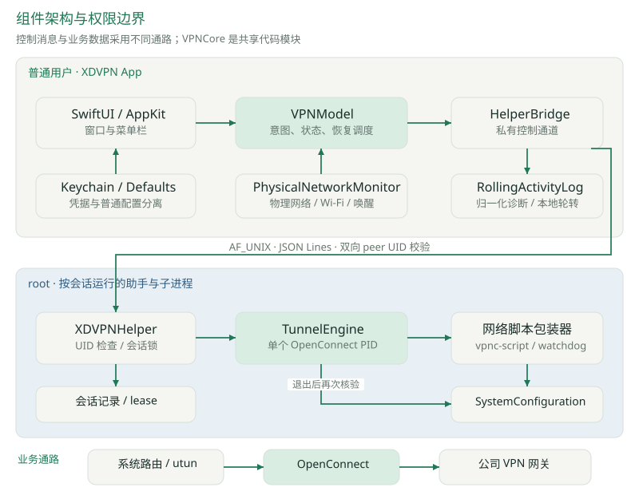

主 App 运行于普通用户身份，负责显示、配置、连接意图、网络观察和本地诊断。按需启动的 root 助手负责特权执行、单个 OpenConnect 子进程及其清理记录。VPNCore 是两个可执行文件共同依赖的 Swift 模块，不是第三个服务进程。

控制通路是 App 与助手之间的本地 Unix socket。业务流量经系统路由进入 utun，再由 OpenConnect 处理隧道传输；SwiftUI 与控制 socket 不转发业务数据。vpnc-script 负责常规网络配置，助手额外使用 SystemConfiguration 核验并清理本次 IPv4/DNS 动态服务键。

### 2.2 技术栈与选择理由

| 技术 | 使用位置 | 选择理由与代价 |
| --- | --- | --- |
| SwiftUI + AppKit | 窗口、菜单栏、应用生命周期 | 原生控件与系统集成直接；部分生命周期仍需要 AppKit 委托 |
| Swift Package Manager | 2 个 executable、1 个共享 target、2 个测试 target | 无第三方 Swift 包；不是传统 Xcode 工程结构 |
| OpenConnect | AnyConnect 认证与隧道传输 | 复用成熟引擎；依赖本机 Homebrew 安装和输出格式 |
| Foundation Process / Darwin | 子进程、信号、socket、文件锁 | 可精确管理 PID 和资源；需自行处理退出竞态与边界 |
| SystemConfiguration | 物理配置快照、动态存储清理 | 直接读取系统网络配置；只覆盖已实现的接口与键范围 |
| CoreWLAN + Network | Wi-Fi 事件和 NWPathMonitor 回退 | 提供物理变化入口；重复通知必须去重 |
| Security + LocalAuthentication | 钥匙串 CRUD、非交互存在性检查 | 凭据由系统保存；实际读取仍可能需要用户允许钥匙串访问 |
| CryptoKit + codesign + visudo | 助手安装检查 | 校验复制完整性、签名有效性和授权规则语法；未建立企业级身份信任链 |

Package.swift 使用 Swift tools 6.0，但显式设置 `swiftLanguageModes: [.v5]`。因此不能将当前项目描述为已经完成 Swift 6 严格并发迁移。所有 target 的最低系统版本为 macOS 14。

### 2.3 模块职责

| 模块 | 主要入口 | 职责 |
| --- | --- | --- |
| XDVPN | XDVPNApp / VPNModel | App 状态、用户操作、页面、菜单栏、恢复调度 |
| XDVPN | HelperBridge / PrivilegeManager | 通信建立、助手生命周期、安装与版本状态 |
| XDVPN | PhysicalNetworkMonitor / RollingActivityLog | 网络事件筛选、可追溯诊断 |
| VPNCore | Profile / Messages / LocalSocket | 校验、命令构造、通信协议与帧边界 |
| VPNCore | TunnelEngine / SessionLease | 子进程所有权、停止升级、会话互斥 |
| VPNCore | TunnelNetworkSession / NetworkScriptRunner | 会话归属、原生清理、脚本 watchdog |
| XDVPNHelper | main.swift | root 身份验证、命令循环、EOF 后独立清理 |

依据：`Package.swift`、`Sources/XDVPN/XDVPNApp.swift`、`Sources/XDVPNHelper/main.swift` 及 VPNCore 源码。

## 03 UI 信息架构与视觉思路

### 3.1 两种使用密度

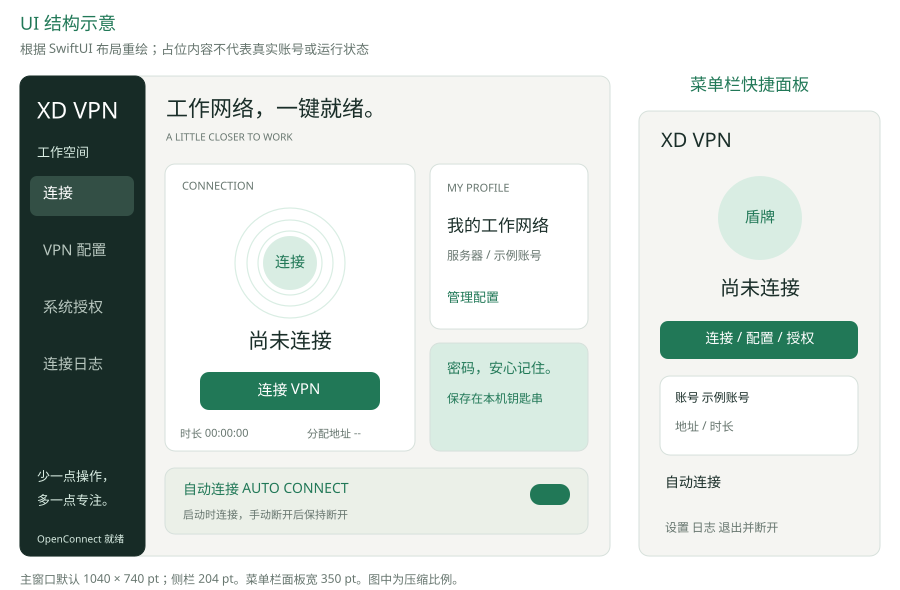

主窗口承载完整信息：左侧导航，右侧页面标题与内容。连接页将“当前连接状态和主操作”置于视觉中心，右侧放配置摘要与钥匙串说明，下方单独放 Auto Connect。菜单栏面板复用同一 VPNModel，压缩为状态、操作、地址、时长和设置入口。

这种布局对应两类使用频率：首次配置、授权和排查在窗口完成；日常连接和查看状态在菜单栏完成。页面共享同一状态源，避免窗口与菜单栏各维护一套连接逻辑。

| 页面 | 核心信息 | 操作与反馈 |
| --- | --- | --- |
| 连接 | 状态、说明、真实分配地址、时长、配置摘要 | 连接 / 断开 / 取消；问题提示；Auto Connect |
| VPN 配置 | 名称、服务器、用户名、认证组、VPN 密码 | 保存、显示或隐藏输入、忘记密码；表单错误就地显示 |
| 系统授权 | 助手状态、Mac 密码与 VPN 密码区别 | 安装 / 升级 / 修复 / 移除 / 重新检测 |
| 连接日志 | 本次事件、时间、错误标记 | 复制当前列表、清空当前列表、打开历史日志目录 |

### 3.2 视觉语言与设计变量

整体采用深绿导航、暖浅色背景与白色卡片。绿色用于主要操作及连接状态；警告使用暖黄色区域。断开按钮使用深色，避免日常结束连接呈现过强危险感。装饰性轨道与盾牌表达连接和保护，但真实状态仍由文字给出。

| 变量 | 当前值 | 用途 |
| --- | --- | --- |
| canvas | `#F6F7F3` | 主背景 |
| sidebar | `#192D27` | 左侧导航 |
| ink | `#1B302A` | 主文字、断开按钮 |
| green | `#227858` | 连接按钮、强调色 |
| mint | `#DAEFE3` | 连接装饰、轻量背景 |
| muted | `#7D8983` | 次级说明 |
| line | `#E6EAE3` | 卡片边界、分隔线 |

主窗口默认 1040 × 740 pt，内容最小 990 × 720 pt，侧栏宽 204 pt，连接页右侧卡片列宽 226 pt。内容区左右留白 32 pt；通用 Card 圆角 20 pt；主按钮高 46 pt、圆角 12 pt。菜单栏面板宽 350 pt、内边距 22 pt。以上均为代码中的布局值，不是对所有屏幕尺寸的适配承诺。

主窗口与面板显式使用浅色外观；菜单栏图标采用系统单色模板，自适应菜单栏环境。当前没有完整深色主题，也没有小窗口或移动端布局。

### 3.3 状态表达与可访问性

| 状态组 | 主操作 | 菜单栏符号 | 交互含义 |
| --- | --- | --- | --- |
| idle / failed | 连接或配置 | 带叉 / 感叹号盾牌 | 可以发起新的连接动作 |
| authorizing / connecting / reconnecting / waiting | 取消连接 | 循环箭头 | 当前存在连接意图，用户可以终止 |
| connected | 断开连接 | 带勾实心盾牌 | 已收到隧道建立或恢复事件 |
| disconnecting | 正在断开，禁用 | 循环箭头 | 等待旧进程和清理结果，避免重入 |

菜单面板会在授权未就绪时直接引导“安装系统授权”；主窗口的 `readyToConnect` 仅表示 profile 和密码存在，点击连接后由准备流程检测授权并导航。此处保留当前实现差异，没有将二者写成完全相同的入口逻辑。

文本、表单及菜单图标提供 accessibilityLabel；装饰性的 OrbitView 对辅助功能隐藏；减少动态效果开启时不执行呼吸缩放。时长使用等宽数字，地址允许缩放。快捷键包括 Cmd-K 连接/取消、Cmd-S 保存、Cmd-, 配置和 Cmd-Q 退出。完整 VoiceOver、文字对比度与放大显示验收尚无记录；部分说明字体仅 8-11 pt，是后续可用性检查重点。

“已安全连接”表示引擎报告隧道建立，不证明所有公司服务可达或所有流量都被 VPN 接管。时长从本次首次 connected 开始，旧进程内恢复不清零，完整重登录会重置；恢复等待可能计入时长，因此不是业务有效在线时长指标。

## 04 用户旅程与操作契约

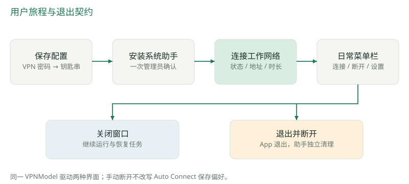

### 4.1 首次使用

用户填写并保存单个 VPN 配置，VPN 密码进入钥匙串。连接引擎缺失时，页面显示 `brew install openconnect` 和重新检测入口。用户再进入系统授权，安装助手并完成 macOS 管理员确认；安装结束后回到连接页。

后续连接使用 `sudo -n`，没有日常交互式提权入口。VPN 密码与 Mac 管理员密码是不同凭据，UI 明确解释；App 不保存管理员密码。钥匙串访问授权属于另一条系统机制，重新签名后仍可能再次出现访问提示。

### 4.2 配置的操作边界

仅在 `canEdit = !state.isActive` 时允许保存配置、忘记密码、安装或移除授权。等待重试也属于 active 状态，因此用户需先取消本次连接意图才能编辑。保存成功后回到连接页并显示短暂 toast；离开配置页面时清空密码输入与显示状态。

“忘记密码”和“移除授权”均有应用内确认提示。前者删除对应钥匙串项，后者删除本客户端助手和 sudoers 规则；两者不自动改写 Auto Connect。普通连接与断开不增加确认弹窗。

### 4.3 窗口关闭、退出和重复启动

关闭红色窗口按钮只关闭窗口，App 仍在菜单栏运行。选择“退出并断开”或 Cmd-Q 会立即移除菜单栏入口，取消 App 的恢复与重试任务，通知助手 shutdown 并关闭通道。助手独立完成旧进程和网络清理；App 正常退出最多等 1 秒排空文件日志，不等待最后一条 stopped 回执。

同 bundle ID 的运行实例检查与用户目录内的文件锁共同限制重复启动。第二实例不启动自动连接、监控和真实文件日志，并尝试激活已有应用。此约束属于本客户端；其他 bundle ID 的 VPN 应用不受其全局管理，也不能据此宣称能安全并行建立多个 VPN。

## 05 配置模型、凭据与存储

### 5.1 数据分层

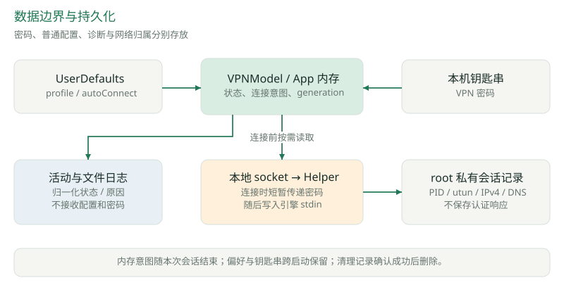

| 数据 | 模型或位置 | 生命周期与约束 |
| --- | --- | --- |
| 普通配置 | VPNProfile；UserDefaults 的 `profile` JSON Data | 跨启动保存；不含密码 |
| 自动连接偏好 | UserDefaults 的 `autoConnect` | 跨启动保存；用户操作显式修改 |
| VPN 密码 | Keychain generic password | service=`com.xd.vpn.credentials`；账号键由配置身份构成 |
| 本次连接意图 | `desiredConnection` | 内存状态；手动断开或终止错误后关闭 |
| 尝试标识 | VPNModel 的 `generation` UUID | 隔离过期异步任务；也进入诊断日志 |
| 网络清理记录 | root 私有目录中的 tunnel.json 与 lease | 成功清理后删除；失败保留用于下次核验 |
| 本次 UI 日志 | ActivityEntry 数组 | 最多 300 条；清空只作用于列表 |
| 历史诊断 | activity.jsonl 及轮转文件 | 最多 4 × 1 MiB，跨启动保留 |

普通配置包含 `name`、`server`、`username`、`authGroup`。凭据账号键为 `server + "|" + username + "|" + authGroup`，显示名称不参与身份。因此只修改显示名称可保留密码；更换服务器、账号或认证组后，需要该身份已有凭据或重新输入密码。成功保存新身份后尝试删除旧凭据，删除失败记录提示，不回滚已保存的新配置。

### 5.2 输入校验

| 字段 | 实际校验 |
| --- | --- |
| 服务器 | 缺少 scheme 时补 https；仅允许 HTTPS；host 非空且不以 `-` 开头；不允许 userinfo、query、fragment 或空白；端口 1-65535 |
| 配置名称 | 去首尾空白，空名称回退“工作网络” |
| 用户名 | 去首尾空白后非空 |
| 普通字段 | 各不超过 1024 UTF-8 字节，拒绝控制字符 |
| 密码 | 1-4095 UTF-8 字节，拒绝换行、回车和 NUL |

客户端和助手的命令构造路径都会执行校验。用户名、认证组和服务器作为 `--name=value` 形式的独立参数传递，不经过 shell 字符串拼接。profile 中的服务器路径被保留；它与单独的认证组字段是不同输入。

### 5.3 凭据处理

钥匙串新增项使用 `kSecAttrAccessibleWhenUnlockedThisDeviceOnly`，没有 iCloud 同步设置。存在性检查通过禁止交互的 LAContext 查询属性，避免启动阶段仅为判断“是否保存过密码”就主动读取密码。真正连接时才读取密码并经 socket 传给助手，再写入 OpenConnect stdin。

密码不进入命令行、子进程环境、配置 JSON、日志或临时凭据文件。但连接期间 App、助手及 JSON 编解码会短暂持有明文；当前没有专用内存锁定或显式清零机制，不能将“存储于钥匙串”扩大为“密码从不进入内存”。[钥匙串可访问性参考](https://developer.apple.com/documentation/security/ksecattraccessiblewhenunlockedthisdeviceonly)。

## 06 特权助手与本地通信

### 6.1 安装与权限模型

本项目采用个人本机使用的特权模型：受保护助手持久安装，root 进程按会话启动，无常驻 root daemon。安装/升级/修复通过 osascript 的管理员授权执行安装脚本；正常运行只允许执行固定助手入口。

| 对象 | 路径或检查 |
| --- | --- |
| 安装助手 | `/Library/PrivilegedHelperTools/com.xd.vpn.helper` |
| 专用授权规则 | `/private/etc/sudoers.d/xd-vpn-astra` |
| 会话 socket | `/private/tmp/xdvpn-XXXXXX/control.sock` |
| root 会话锁 | `/private/var/run/com.xd.vpn.<uid>.lock` |
| 网络记录目录 | `/private/var/run/xdvpn-network-<UUID>/` |

安装脚本依次检查父目录为 root 所有且不可被组/其他用户写入、主 sudoers 已启用目标 includedir、复制后 SHA-256 与 App 计算值一致、助手严格签名验证通过、专用规则通过 visudo 语法检查，再替换目标文件。助手权限为 0755，规则为 0440。脚本不修改主 sudoers，也不批量开放其他命令。

授权规则仅允许当前合法用户名执行 `--version` 或 `--session <socket>`。内部 `--network-script` 未加入 sudoers 规则，仅接受已有 root 身份与合法私有网络会话目录。助手的会话用户由 sudo 提供的 SUDO_UID 决定，拒绝 UI 自报 UID。

这些检查验证文件完整性、安装位置和运行身份。ad-hoc 签名没有建立固定开发者身份；App 到助手的认证主要依赖文件权限与 peer UID，没有 XPC 的调用方代码签名约束。个人模型信任本机用户管理的 App、Homebrew OpenConnect 及 vpnc-script，不应作为多用户企业分发的完整安全方案。

### 6.2 通信协议

| 方向 | 消息类型 | 关键字段或语义 |
| --- | --- | --- |
| App → Helper | connect | profile、password；助手验证后启动子进程 |
| App → Helper | disconnect | 停止当前子进程并核验清理 |
| App → Helper | reconnect | 仅对已建立且未停止的会话发送 SIGUSR2 |
| App → Helper | shutdown | 结束命令循环；完成清理后退出 |
| Helper → App | ready / connecting / connected / reconnecting | message、可选 address、retryable |
| Helper → App | info / failure / stopped | 归一化诊断、终止错误与最终退出结果 |

协议使用 AF_UNIX SOCK_STREAM，每条 Codable JSON 以换行分帧。JSON 内容必须小于 32768 字节；不接受任意 executable、脚本路径、PID 或 shell 指令。格式错误、超长帧或 EOF 导致通信结束，并由助手触发当前隧道清理。

随机目录权限 0700，socket 权限 0600。App 接受连接时用 `getpeereid` 核验对端 UID=0；助手连接时核验对端为 SUDO_UID，并检查目录/socket 的属主、类型和权限。监听 socket 非阻塞，accept 后明确恢复阻塞读取；读写分别加锁，处理 EINTR 和部分写入。FD_CLOEXEC、SO_NOSIGPIPE 与延迟释放 descriptor 降低继承、断链和 FD 复用风险。

HelperBridge 的 `session` UUID 用于隔离旧通道事件；ConnectionResult 用锁保证异步 continuation 只完成一次。版本号不放在每条消息里，兼容检查通过已安装助手的 `--version` 完成；当前精确要求版本 4，数字不同会显示需要升级。

## 07 连接建立与引擎适配

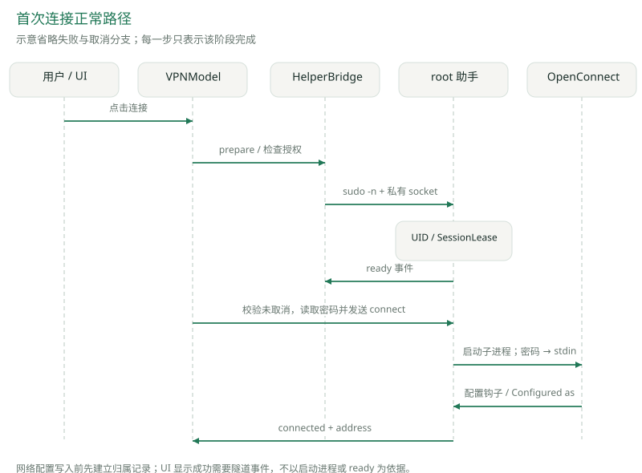

### 7.1 连接步骤

1. VPNModel 检查配置、密码存在性和引擎路径；若物理网络未就绪或系统睡眠，则保存连接意图并进入 waiting。
2. 生成本次 generation，进入 authorizing。HelperBridge 检查授权、建立私有 socket 并使用 sudo -n 启动助手。
3. 助手核验身份并持有当前 UID 的 SessionLease。连接命令真正发送前，App 再检查意图、generation 和任务取消状态，然后读取密码。
4. TunnelEngine 先处理之前被阻塞的清理，再创建网络会话记录容器，构造固定 OpenConnect 参数并启动前台子进程。
5. 密码写入 stdin 后关闭写端。OpenConnect 执行认证和隧道建立；connect 钩子在实际配置前写入归属记录。
6. 引擎读取合并的 stdout/stderr，只把允许的状态行转为 HelperEvent；App 收到 connected 后显示地址与时长。

序列图为正常路径，省略错误分支；其中“ready”表示助手可用，不表示 VPN 建立。HelperBridge 的 socket 就绪与助手完成会话锁检查也不是同一时点，不能把建连 socket 当作最终 ready 回执。

### 7.2 参数与环境约束

| 参数 / 策略 | 当前设置 | 项目意图 |
| --- | --- | --- |
| 协议 | `--protocol=anyconnect` | 固定兼容目标 |
| 密码传输 | `--passwd-on-stdin` | 避免密码出现在 argv |
| 交互认证 | `--non-inter`、`--no-external-auth` | 不等待 UI 无法处理的认证交互 |
| CSD | `--csd-wrapper=/usr/bin/false` | 不以 root 执行服务器提供的主机检查程序 |
| 引擎恢复窗口 | `--reconnect-timeout=300` | 引擎自身的最长尝试参数；可能被 App 恢复预算提前结束 |
| DPD | `--force-dpd=20` | 引擎隧道存活探测间隔参数 |
| 网络脚本 | 固定已安装助手 `--network-script` | 将脚本调用放入归属记录与 watchdog 约束 |
| 子进程环境 | 固定 PATH、LANG=C、LC_ALL=C、HOME=/var/root | 不继承用户代理与动态加载环境；日志归一化使用固定语言环境 |

OpenConnect 从四个已知 Homebrew bin/sbin 路径依次查找；vpnc-script 从 Apple Silicon 或 Intel Homebrew 的 etc/vpnc 目录查找。当前未锁定 Homebrew 包版本，也未随 App 打包连接引擎；重新部署必须验证所用版本支持这些参数。

### 7.3 连接成功与协议概念

首次连接只有观察到 `Configured as ...` 才认定隧道已配置；首次 `CSTP connected.` 不能单独触发 connected。既有隧道的 `CSTP reconnected`，或已建立前提下再次 `CSTP connected.`，可认定传输恢复。DTLS 成功只记录信息，不决定首次隧道是否已就绪。

OpenConnect 的认证与隧道数据阶段由引擎负责；SIGUSR2 用于促使已有数据会话立即重建传输。DPD、引擎恢复窗口和 SIGUSR2 的含义可参见 [OpenConnect 官方手册](https://www.infradead.org/openconnect/manual.html)。项目中的 1 秒、3 秒和停止升级预算属于客户端策略，不是协议要求。

输出解析属于有限字符串匹配，未知行会被过滤。它降低凭据泄漏与 UI 噪声，也使可观察性依赖输出措辞；没有结构化的 OpenConnect 状态 API 接入。首次登录超过 90 秒仍未建立会话时，引擎请求停止，后续按退出与错误分类决定是否重试。

## 08 状态机与 Auto Connect 语义

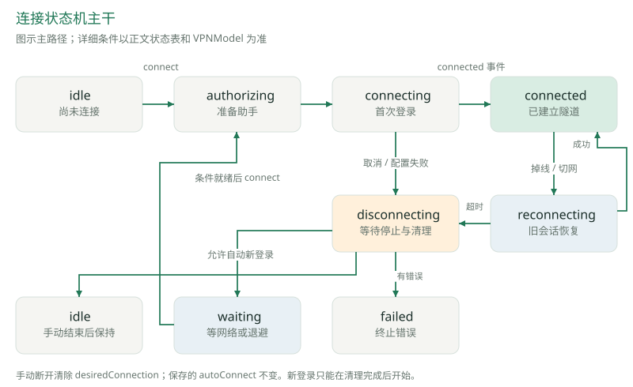

### 8.1 三层状态分工

`autoConnect` 是持久偏好；`desiredConnection` 是本次会话意图；`state` 是对外显示的运行阶段。另有 `tunnelEstablished` 表示是否存在可尝试复用的已建立隧道，`restartAfterStop` 表示待清理结束后是否立即登录。不能只根据一个“自动连接”开关推导所有行为。

| 用户动作 / 事件 | 保存偏好 | 本次意图与结果 |
| --- | --- | --- |
| 应用启动且 Auto Connect 开启 | 保持开启 | 发起 connect；仍需满足配置、引擎、凭据与授权 |
| 空闲时开启 Auto Connect | 写 true | 不立即连接，下一次启动或后续已发起会话按偏好处理 |
| 手动连接 | 不变 | desiredConnection=true |
| 手动断开或取消 | 不变 | desiredConnection=false；取消重试、恢复和过期准备任务 |
| 已连接时关闭 Auto Connect | 写 false | 不立即断开；后续恢复超时会清理，但不重新登录 |
| waiting 时关闭 Auto Connect | 写 false | 取消待执行重试并回到 idle |
| 认证、证书或助手终止错误 | 不变 | 结束本次自动重试，等待用户处理 |
| 删除密码或移除授权 | 不变 | 下一次连接需重新满足前置条件 |
| 退出应用 | 不变 | 清除内存意图并清理；重启重新读取保存偏好 |

手动断开后，即使发生网络变化或系统唤醒，也不会自动连接，直到用户再次点击连接或重新启动 App。关闭 Auto Connect 后，已建立会话仍可进行一次受预算限制的旧会话恢复；Auto Connect 主要决定是否自动发起新的登录。

首次登录中切网是例外场景：因为还没有可复用隧道，代码会停止旧握手、核验清理后继续当前手动连接意图，可能在 Auto Connect 关闭时继续登录。它不是启动新的后台自动连接偏好。

### 8.2 状态不变量

| 不变量 | 保护方式 |
| --- | --- |
| 旧登录任务不能在取消后读取密码并发送连接 | Task.cancel + generation 校验 |
| 旧 socket 回调不能污染新会话 | HelperBridge session 校验 |
| 未确认清理时不能并发新建隧道 | disconnecting、restartAfterStop、TunnelEngine cleanupBlocked |
| 手动断开后不可被网络事件自动拉起 | 所有恢复入口检查 desiredConnection |
| 终止错误不造成无限认证重试 | failure 清除本次意图并等待 stopped |
| 连接期间不能改配置或授权 | canEdit 与界面禁用 |

failed 是可操作的检查状态；failure 事件到达时通常先进入 disconnecting，保持控件锁定，等 stopped 后再进入 failed。助手意外失联则直接转为 failed，由独立助手清理机制承担剩余生命周期，UI 不能因此声明系统网络一定已清理。

## 09 物理网络识别与恢复调度

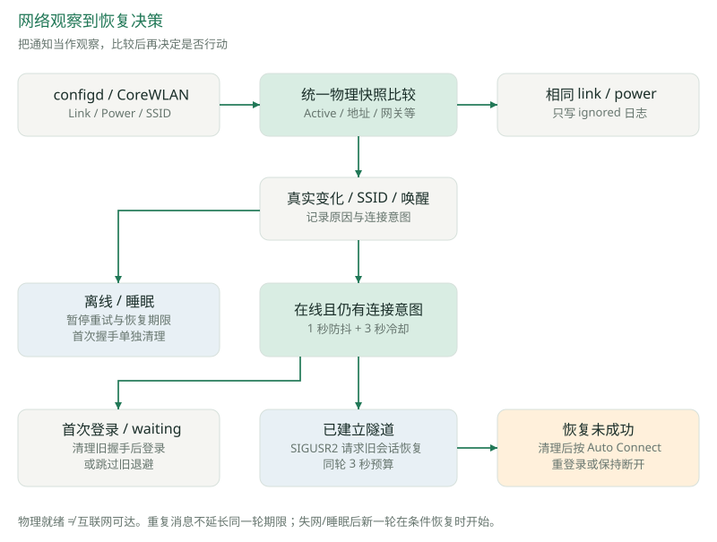

### 9.1 识别真正的网络变化

PhysicalNetworkMonitor 监听 `State:/Network/Interface/en[0-9]+/(IPv4|IPv6|Link)`，仅保留 Active、Addresses、Router、SubnetMasks、PrefixLength。VPN 全局 DNS、路由服务、utun 以及物理接口上的 AdditionalRoutes 不进入比较，避免 VPN 自己修改网络又触发自己重连。

configd、CoreWLAN link 与 power 通知共用同一快照比较入口。相同配置即使跨越多轮防抖或冷却时间再次到达，也只生成 ignored 诊断，不触发恢复。SSID 变化通知独立保留，即使 IP/网关相同也可以提示网络切换；代码不读取或保存 SSID/BSSID 值。

网络就绪要求同一个 en 接口同时拥有有效 Link Active 和可用 IPv4/IPv6 地址。IPv4 排除未指定、回环、169.254 自分配与组播等地址；IPv6 接受全局单播或 ULA。有效私网地址可满足此判断，因此它只表示具备尝试访问 VPN 的条件，不表示互联网或 VPN 网关可达。

只有物理快照监听不可用时，才采用排除 `.other` 接口的 NWPathMonitor 回退；回退本身不等同于主路径的逐接口快照检查。CoreWLAN 监听部分失败时保留仍可用的监听与 DPD。没有可确认配置变化或 SSID 通知的同址同 SSID 漫游，仍交给 OpenConnect 自身处理。

### 9.2 恢复调度规则

有效网络变化先重置退避，再设置 pendingRecovery 与原因集合。约 1 秒防抖合并连续通知；同一进程两次主动恢复至少间隔 3 秒，使用 ContinuousClock，避免系统时间调整影响冷却。冷却期间的新变化会保留，执行时刻取“最新通知后 1 秒”和“上次命令后 3 秒”的较晚值。

已建立隧道在物理网络断开时暂停 App 主动恢复和恢复期限，保留旧会话，不主动发送 disconnect 或 SIGUSR2。首次登录尚未完成时则停止并核验部分配置；授权准备阶段失网会取消旧任务并等待。睡眠期间同样暂停重试和恢复期限，唤醒后重新调度。

网络就绪后，已建立会话通过 reconnect 命令请求 SIGUSR2；首次握手则先清理再登录；waiting 会跳过旧退避等待；disconnecting 只保留待恢复意图，不能重叠启动。

### 9.3 一轮恢复预算

当物理网络可用且存在已建立隧道时，切网触发与引擎自行报告掉线统一进入 reconnecting，并创建 3 秒恢复期限。重复掉线消息、重复通知和后续恢复命令不会延长同一轮期限。成功 connected 会取消期限；失网或睡眠会取消当前期限，网络恢复后再开始新一轮。

到期仍未恢复则停止旧隧道并核验清理。Auto Connect 开启时清理后重登录；关闭时保持断开，以减少死隧道影响普通网络的时间。物理网络虽然就绪但新 Wi-Fi 需要网页认证时也遵循此策略，无法保证自动识别或打开认证页。

旧会话恢复期间发生接口/路由配置错误，且 Auto Connect 开启时，App 等待 stopped 后立即重登录，不额外等退避或剩余恢复期限；若新登录再次失败则停止并提示检查安装。认证、证书与原生清理错误不会按该例外处理。

## 10 时间预算与停止策略

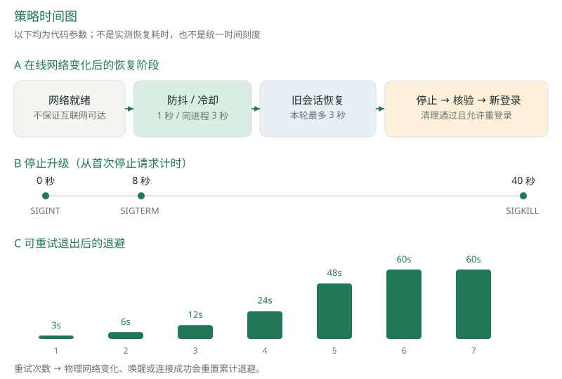

| 时间项 | 当前值 | 起点与含义 |
| --- | --- | --- |
| 网络事件防抖 | 1 秒 | 最新有效网络变化后；稳定后再安排恢复 |
| 主动恢复冷却 | 3 秒 | 同一个 OpenConnect 进程上次 App 恢复命令之后 |
| 旧会话恢复预算 | 3 秒 | 在线且已建立的会话进入本轮恢复之后 |
| 自动重试退避 | 3、6、12、24、48、60 秒，之后 60 秒 | 可重试退出后；网络变化、唤醒与成功连接重置计数 |
| DPD 参数 | 20 秒 | 引擎存活探测；不等于 20 秒内必然判定故障 |
| 引擎 reconnect timeout | 300 秒 | 引擎恢复参数，可能被 App 更早停止 |
| 初次连接 watchdog | 90 秒 | 子进程已启动但仍未建立隧道 |
| 停止信号升级 | 0 秒 SIGINT；8 秒 SIGTERM；40 秒 SIGKILL | 都从首次停止请求计时，40 秒不是再等 40 秒 |
| vpnc-script watchdog | 15 秒 | 每次受控脚本执行预算 |
| utun 异步销毁等待 | 最多 2 秒 | 进程退出后的原生核验，轮询期间持续重读归属 |
| 用户会话锁等待 | 最多 12 秒 | 新助手等待旧助手释放同 UID 锁 |
| socket accept | 8 秒 | App 等待 root 助手连入本地 socket |
| 授权操作超时参数 | 180 秒 | PrivilegeManager 请求管理员授权的运行保护 |
| 日志退出排空 | 最多 1 秒 | App 正常退出，不作为助手清理期限 |

端到端恢复时间包含“网络重新具备条件 + 防抖/冷却 + 旧会话尝试 + 停止及核验 + 新登录”，不能从 1 秒或 3 秒参数推导恢复 SLA。TCP/TLS 认证与服务端响应仍可能主导耗时。图中的退避曲线是 RetryPolicy 公式 `min(60, 3 × 2^min(attempts,5))` 的展示，不是线上延迟数据。

TunnelEngine 对自己创建的 OpenConnect PID 使用 Darwin.kill，不使用可能涉及整个进程组的 Process.interrupt/terminate 来停止隧道。普通停止期间保留脚本树，让清理有机会完成；升级信号仍只作用于该 PID。

网络脚本是另一种资源：NetworkScriptRunner 用 posix_spawn 在脚本执行前原子创建独立进程组，关闭非标准描述符继承，stdin 指向 /dev/null。仅在脚本超时时向该已知组发送 SIGKILL，并 waitpid 回收，以阻止清理后仍有旧脚本继续写系统配置。两类信号作用范围不能混用。

脚本以 `/bin/sh <脚本路径>` 启动，而不是直接 exec 会话内生成的 `vpnc-managed-script`。macOS 会对首次执行的新文件做 Gatekeeper／来源评估并联网查询公证票据：本机实测每次约 0.25 秒，隧道被阻塞、系统解析器又指向隧道 DNS 时会等到约 3 秒超时。把文件作为解释器参数传入可以完全避开这一评估；OpenConnect 自身也是以 `/bin/sh -c` 方式调用脚本的。

## 11 网络清理、归属与异常恢复

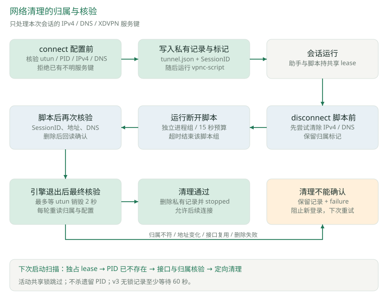

### 11.1 为什么需要原生清理兜底

既有故障与回归记录显示，vpnc-script 的断开流程可能先执行路由处理，路由操作又可能受失效 DNS/网络影响而阻塞，因而尚未走到后面的动态存储清理。仅看到 OpenConnect 退出，或者仅给进程发送停止信号，都不能证明系统解析器恢复。

方案保留 vpnc-script 的正常配置能力，增加独立于 DNS、网关、shell 和隧道可达性的 SystemConfiguration 清理。此清理仅处理本次 utun 的 IPv4、DNS 与 XDVPN 归属标记，不是任意系统网络状态的全量回滚。[SystemConfiguration 框架参考](https://developer.apple.com/documentation/systemconfiguration)。

### 11.2 配置前写入归属

connect 钩子从环境读取 VPNPID、TUNDEV、INTERNAL_IP4_ADDRESS、INTERNAL_IP4_DNS。记录要求 PID > 1、接口名匹配 utun 加 1-5 位数字、IPv4 合法、DNS 最多 16 个 IPv4。写入前拒绝覆盖该接口已有 IPv4、DNS 或 XDVPN 服务键。

通过校验后先原子写入 root 私有目录的 `tunnel.json`，再写入 `State:/Network/Service/utunN/XDVPN` 的 SessionID，之后才允许运行实际 vpnc-script。记录包含 PID、接口、IPv4、DNS，不含密码、cookie 或认证响应；读取记录限制 8192 字节。

恢复钩子不会任意认领新接口或覆盖他人配置。现有原生记录以 IPv4 为中心，不能将物理监听支持 IPv6 推导为 IPv6-only 隧道完整支持；依赖 IPv4 记录的连接/清理路径需要单独扩展与验证。

### 11.3 三道清理检查

1. **disconnect 脚本前：** 尝试删除本次 IPv4/DNS 键并保留 SessionID 标记，尽早解除死隧道解析配置；首次尝试失败不阻止正常脚本运行。
2. **脚本结束后：** 不论正常结束、失败或超时，再次核对并删除本次状态；原生核验成功时，disconnect 可以作为正常完成，即便脚本未完成。
3. **OpenConnect 退出且输出管道结束后：** 父助手再次核验残留；接口异步销毁最多等 2 秒，每次重新读取归属和配置，再删除并回读确认。

实际删除使用 SCDynamicStoreSetMultiple。若键已全部不存在，清理可重复成功；若 SessionID 不匹配、地址/DNS 被更改、同名接口仍在使用，或删除后回读仍存在，就停止并报告清理失败。该保守策略避免误删其他 VPN 或复用接口的配置。

| 脚本阶段 | 超时处理 | 原生检查后果 |
| --- | --- | --- |
| pre-init | 返回错误 | 交给连接失败与退出路径处理 |
| connect | 配置失败 | 尝试清理部分配置，失败保持终止错误 |
| attempt-reconnect / reconnect | 不启动脚本：原生核对服务器路由后返回 0，没有 watchdog | 保留现有会话，隧道重建后立即恢复转发；App 预算仍独立生效 |
| disconnect | 先结束脚本组，再执行原生核验 | 核验通过返回 0；核验失败返回错误 |

恢复阶段不再启动脚本：捆绑脚本在 attempt-reconnect 只设置服务器路由（托管脚本已覆盖为空操作），在 reconnect 只执行不存在的 /etc/vpnc/reconnect.d 钩子，而 OpenConnect 在脚本返回前会阻塞主循环、不转发任何数据包，日志曾记录到这一阶段每次占用 0.2–3.3 秒。真实非零脚本错误仍会分类为失败。用户主动停止期间的通用 script error 作为提示，最终结果交给原生清理决定。

### 11.4 清理阻塞与遗留记录

清理失败后，TunnelEngine 保留 networkSession、旧 PID 和 cleanupBlocked 标记，发送 failure 与 stopped；再次 connect 会先重试旧清理，成功后才能启动新隧道。诊断包含 PID、utun、具体服务键与记录目录，方便定位归属问题。

新建会话前还会扫描本客户端私有前缀的遗留目录。助手与脚本包装器持有共享 lease；扫描只有获得独占锁后才检查记录 PID 是否仍存活，并执行接口、归属和配置核验。持锁的活动记录跳过；PID 仍存在的遗留记录阻止清理，不会杀死它。旧版 v3 无锁记录至少等待 60 秒，避免与旧脚本并发。

助手本身被 SIGKILL 时，没有常驻服务保证立刻兜底；下次启动会保守处理遗留记录。原生兜底不恢复 persistent networksetup DNS、自定义 hooks、任意路由快照或其他客户端的遗留项。当前机制降低本次已知故障风险，但不能宣称“任何崩溃都自动恢复全部网络”。

## 12 并发模型与资源生命周期

### 12.1 执行上下文

| 上下文 | 工作 | 竞态控制 |
| --- | --- | --- |
| MainActor | VPNModel、HelperBridge、用户操作与 UI 发布 | 状态变更串行，Task 取消与 UUID 隔离 |
| 引擎专用串行队列 | start / consume / stop / reconnect / finished | process 身份检查、stopSignalled 去重 |
| utility 读取线程 | OpenConnect 输出、socket 接收 | 完整行分帧；回到所属队列处理 |
| 日志串行 utility 队列 | JSONL 编码、写入和轮转 | 整行串行写入，错误独立报告 |
| root 文件锁 | 同 UID 会话锁与网络记录 lease | 跨进程所有权，避免旧清理与新登录交错 |

SessionLease 持有到助手完成子进程停止，UI 退出不会释放 root 锁。锁按 UID 隔离，不是所有用户及所有 VPN 应用共享的全局互斥。网络记录锁则保护助手和每个受控脚本的写入生命周期。

### 12.2 关键取消路径

授权准备期间取消：失效 generation，取消 connectTask，关闭 bridge；准备任务即使稍后成功返回，也不能读取密码和发送 connect。已建立会话取消：清除意图，取消重试和恢复任务，进入 disconnecting，等待 stopped。退出：先设置 isQuitting，使 UI、网络观察与助手消息不再继续推进新连接。

HelperBridge.shutdown 发送 shutdown 后关闭 socket，不主动 terminate sudo，以免连同 root 助手提前终止。Helper main 在命令循环结束、解码错误或 EOF 后调用 engine.stop，等待停止回调，最后关闭连接并退出。App 因崩溃关闭通信时也采用该路径，但助手自身存活仍是前提。

### 12.3 有界资源

引擎未完成行缓冲超过 16384 字节时丢弃，避免无限保存服务器输出；协议帧小于 32768 字节；UI 日志 300 条；文件日志总量最多 4 MiB；单条诊断 message 截至 2048 个字符。后台写队列没有单独的有界队列或背压，因此磁盘上限不等于极端事件洪峰下的严格内存上限。

## 13 可观察性与日志设计

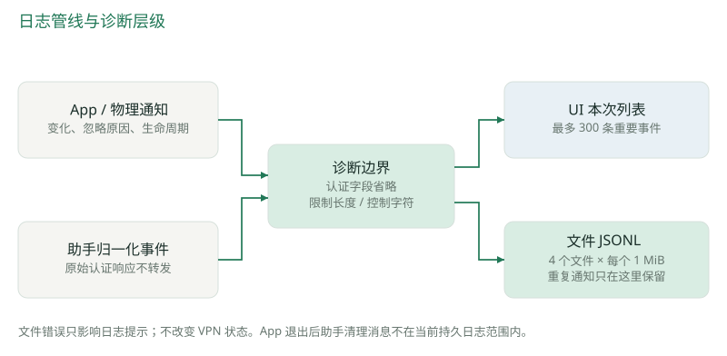

### 13.1 两级日志

UI 列表用于当前使用过程，展示重要事件和错误；重复网络状态复述仅进入文件，避免刷屏。文件用于跨启动排查，主实例显式注入 RollingActivityLog；测试和第二实例默认不创建用户真实日志。

| 字段 | 含义 | 排查用途 |
| --- | --- | --- |
| timestamp | UTC、毫秒精度 | 对齐切网、唤醒与恢复时间 |
| session / version | App 会话 UUID / 应用版本 | 区分重启和版本变化 |
| source | app / physical / helper / recovery / lifecycle | 区分事件来源 |
| event | 事件名称或 helper kind | 如 notification.ignored、recovery.deadline |
| stateBefore | 处理该条消息之前的显示状态 | 判断事件触发时所在阶段 |
| connection | generation UUID | 关联连接尝试；取消时也可能更新 |
| autoConnect / isError | 保存偏好快照 / 错误标记 | 判断重试意图和严重程度 |
| message | 归一化说明 | 只保存允许的诊断内容 |

典型排查应串联 configuration.changed → reconnect.requested → helper reconnecting/connected 或 recovery.deadline → stopped → connect.begin。`reconnect.requested` 只表示 App 已发送命令；底层信号、隧道恢复及清理必须结合助手回执。stateBefore 不是处理后的最终状态，connection 也不是 OpenConnect PID 或服务器会话 ID。

### 13.2 隐私与文件安全

日志接收 App 生成的诊断与已有助手归一化事件，不直接接收原始 stderr。物理事件只保存变化字段名，不保存地址值、SSID 或 BSSID；配置和凭据不传给日志组件。附加正则会省略常见 password、cookie、authorization、token、secret、bearer 等认证文本，并去除控制字符。

目录为 `~/Library/Logs/XD VPN/`，权限 0700；活动文件与历史文件权限 0600。活动文件通过 O_NOFOLLOW、O_NONBLOCK、fstat、属主和硬链接数量检查拒绝符号链接、硬链接、FIFO 与非普通文件。轮转只操作固定名称 activity.jsonl、activity.1.jsonl 至 activity.3.jsonl，不枚举删除其他文件。

文件写入失败仅提示“文件日志暂不可用”，VPN 状态与内存列表继续工作。正常退出排空队列，最多等 1 秒。轮转按大小而非天数，因此没有固定的日志保留天数承诺。

### 13.3 当前诊断盲区

助手 v4 未转发的 DTLS 握手失败仍不可见；App 退出后助手独立清理期间的消息不会写入 App 日志；日志没有吞吐、服务可达性或所有信号返回值。旧会话内重传输、完整重新登录、utun 重建是三种不同事件，不能仅根据新 TCP 连接推断完整重登录。

## 14 异常分类与重点取舍

### 14.1 错误处理矩阵

| 情况 | 处理策略 | 用户结果 |
| --- | --- | --- |
| DNS/TCP 连接失败 | 标记 transportFailure；可重试退出走退避 | 网络恢复后可自动重试 |
| 传输失败后附带 cookie 获取失败尾语 | 不直接当密码错误 | 避免误停网络故障重试 |
| 认证失败、证书错误、额外认证 | 终止本次意图，等待清理 | 提示检查配置、联系 IT 或使用公司客户端 |
| 已建立会话恢复时配置失败 | Auto Connect 开启则等 stopped 后立即登录 | 尝试重建；新登录仍失败则停止 |
| 初次登录配置失败 | 终止错误并清理部分配置 | 检查 OpenConnect / vpnc-script |
| 恢复钩子（attempt-reconnect／reconnect） | 原生核对服务器路由后返回 0，不启动脚本 | 隧道重建后立即恢复转发，仍受 App 恢复预算约束 |
| 原生清理失败 | 保留记录并阻止新登录 | 显示 PID、utun、键与记录路径 |
| 助手不可用或失联 | 停止本次重试 | 重新检测或更新授权 |
| 日志失败 | 不改变连接状态 | 保留本次内存记录 |

未知认证失败采用保守终止，减少反复提交错误密码造成账户锁定的风险。错误分类目前部分依赖归一化 message 字符串；将来引入结构化错误码需要同时考虑 App/Helper 版本兼容，不能只改一端。

### 14.2 架构取舍记录

| 选择 | 带来的收益 | 已接受的代价 |
| --- | --- | --- |
| 原生 App + 外部 OpenConnect | UI 和系统集成可控，复用协议实现 | 外部依赖安装、版本差异和字符串解析 |
| 按需助手 + 专用 sudoers | 本机使用安装简单，日常无需重复提权 | 信任用户管理的引擎与脚本，缺少稳定调用方签名边界 |
| 有效物理快照驱动恢复 | 避免路由/DNS 自触发循环 | 不保证识别所有同址漫游或认证门户 |
| 在线旧会话 3 秒预算 | 尽早拆除失效隧道，减少阻塞普通网络 | 可能放弃本可在较长窗口恢复的旧会话 |
| 归属不确定时拒绝删除 | 避免误清其他连接 | 可能需要人工排查才能再次连接 |
| 归一化日志 | 减少敏感内容与噪声，限制磁盘占用 | 不能还原完整引擎协议交互 |
| UI 退出与助手清理解耦 | 窗口退出不被最后回执卡住 | App 退出后的清理缺少持久诊断采集 |

### 14.3 开发演进中的经验

2026-09-05 的偏好重构把 Auto Connect 从当次连接开关变为独立保存偏好，并加入菜单栏和退出语义测试。网络恢复修复进一步区分物理在线与 VPN 路由/DNS 的全局状态，避免死隧道反过来影响在线判断。

1.1.5 的离线立即断开方案已撤回。1.1.6 引入清理保障但仍存在后续 review 识别的缺口；1.1.7 的助手 v4 增加恢复钩子非致命超时、disconnect 前释放解析状态、共享锁、接口等待和遗留记录复核。1.1.8 只改 App 的重复通知筛选和文件日志，沿用助手 v4。

这些演进说明：通知到达不等于状态改变，脚本返回不等于清理核验，进程退出不等于系统网络恢复。回归测试应覆盖跨层组合路径，尤其是“watchdog 输出 → 引擎分类 → App 重试决策”，不能只分别测试两个工具函数。

## 15 构建、打包与交付

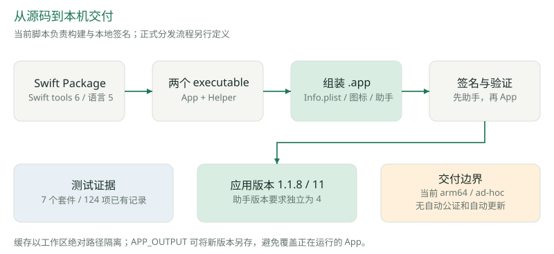

### 15.1 本地流程

```bash
bash scripts/test.sh
bash scripts/build.sh
```

swift-env.sh 以当前工作区绝对路径的 SHA-256 前 16 位生成缓存命名，将 Swift scratch、package cache 与 Clang module cache 放入对应 `.build/workspace-<id>`。这解决复制或移动项目后模块缓存仍引用旧 SwiftShims 路径的问题。

build.sh 默认 Release，构建 App 和 Helper 两个可执行文件；生成 AppIcon，组装 Contents/MacOS、Contents/Helpers、Contents/Resources 与 Info.plist；先签名助手，再签名 App，最后执行 deep/strict 验证。默认输出为 `dist/XD VPN.app`，版本化文件名来自交付时另存，不是脚本自动根据版本命名。

| 构建参数 | 作用 |
| --- | --- |
| CONFIGURATION | 默认 release，可切换构建配置 |
| APP_OUTPUT | 指定输出 .app，避免覆盖正在运行的版本 |
| SIGNING_IDENTITY | 默认 `-`，本地 ad-hoc；可传签名身份 |

### 15.2 版本与升级

Info.plist 当前短版本 1.1.8、构建号 11、bundle ID `com.xd.vpn`。PrivilegePolicy 的助手要求为 4。1.1.8 与 1.1.7 使用相同助手版本，已有 v4 无需再次安装；较旧助手需要升级受保护文件时仍需管理员确认。

配置与钥匙串按 bundle/service 命名沿用，不依赖 .app 文件名。客户端单实例和 root 会话锁降低新旧版本交错风险，但升级验收仍应先断开并退出旧版。测试与交付不能让不同客户端同时建立真实 VPN 后再将网络状态归因给其中一个。

### 15.3 分发边界

当前交付为本机 Apple Silicon 应用，Intel 可以在对应环境编译，但没有本次双架构验收记录。build.sh 未自动执行 Developer ID 公证、stapling、Gatekeeper 分发验收或 ZIP 打包流程。设置 SIGNING_IDENTITY 不能单独代表已完成正式分发。

引擎没有随 App 分发，首次使用依赖 Homebrew；OpenConnect 版本未由项目锁定。若扩大分发范围，需要先确定引擎供应、版本测试、签名与授权服务方案，再定义升级/回滚流程。本文未执行这些外部安装或发布操作。

## 16 验证证据与实机验收

### 16.1 已有自动化结果

本次首次逐项读取 `.build/network-quality-final-test-results.json`，确认 124 条记录均为 passed；当时核对 `.build/network-quality-source-hashes.json` 中的 31 个文件，内容与记录摘要完全一致。这是对历史验证证据与 1.1.8 基线的一致性检查，不是本次重新执行 124 项测试。之后发现的并行改动另见第 19-20 章，不使用这份摘要证明其正确性。

| 测试套件 | 已有通过数 | 覆盖重点 |
| --- | --- | --- |
| VPNModelTests | 63 | 偏好/意图、取消、网络变化、防抖/冷却、期限与退出 |
| NetworkCleanupTests | 24 | 脚本超时、信号树、归属、删除复核、遗留记录 |
| VPNCoreTests | 15 | 输入、命令、socket、输出分类、子进程 |
| NetworkAndPrivilegeTests | 9 | 物理网络快照、通知去重、授权规则解析 |
| RollingActivityLogTests | 6 | 轮转、持久化、并发、权限和不安全文件拒绝 |
| PrivilegePolicyTests | 4 | 助手身份、路径与参数边界 |
| RecoveryIntegrationTests | 3 | 本地真实替身进程与 App 恢复组合 |
| 合计 | 124 | 结果来自已保存的合并验证记录 |

VERIFICATION.md 记录：最终验证中 121 项在受限环境通过，另 3 项系统检查在获准后单独运行通过，合并得到 124 项。不能把这一记录写成“一次全量执行零失败”。Release 构建、签名、ZIP 完整性也有历史通过记录，本文没有重新打包或复验已安装 App。

测试使用临时偏好、凭据替身、本地子进程和可注入动态存储。另有实际安装 OpenConnect 对 `127.0.0.1:1` 的失败路径，以及本机 vpnc-script 实际控制流配合隔离命令替身的阻塞回归；这些都不等于连接公司 VPN 的端到端验收。

### 16.2 待完成的真实环境验收矩阵

| 场景 | 应观察的行为 | 验收证据 |
| --- | --- | --- |
| 已连接后关闭 Wi-Fi 30-60 秒再恢复 | 离线暂停主动恢复，在线后恢复或顺序重建 | 时间线、同次 PID/utun、DNS 与公司服务及公网访问 |
| 离线期间手动断开 | 不因网络恢复再次登录，残留清理可核验 | 用户意图、stopped、动态服务键与解析状态 |
| 新 Wi-Fi 需要网页登录或无互联网 | 旧会话预算到期后清理，按偏好重试或保持断开 | 认证页/公网能否恢复及失败提示 |
| 特定 AP 每 60 秒重复 link ACTIVE | ignored 留档，无额外主动恢复 | 跨多轮通知的 App 与 helper 日志 |
| 同地址同 SSID 漫游 | 无误触发；无明确通知时由引擎恢复 | 引擎会话与业务恢复观测，不承诺即时检测 |
| 睡眠、唤醒、连续网络变化 | 重试暂停，唤醒重置退避；冷却内变化不丢 | 事件来源、命令次数、最终状态 |
| 退出后立即打开新版本 | 无重复菜单入口，不重叠本客户端会话 | 单实例、会话锁、旧清理与新登录顺序 |
| 另一 VPN 占用或接口被复用 | 拒绝覆盖/误删他人配置 | 归属冲突诊断、他人服务键保持正确 |
| 不同 Mac 与分发签名 | 安装、钥匙串访问、助手升级可完成 | Intel/Apple Silicon 与签名公证验收记录 |

验收先固定应用、助手和引擎版本，再一次只验证一个 VPN 会话。记录应区分 App 命令、助手响应、进程退出、系统配置清理与实际访问结果。吞吐、CPU、内存、首次连接耗时和长时间稳定性目前没有统一性能基准；本文不提供虚构数值。

## 17 后续建议与开发维护要点

### 17.1 优先级建议

以下均为建议，未在当前实现中新增功能或承诺交付时间。

| 优先级 | 建议 | 前置条件 / 完成判据 |
| --- | --- | --- |
| P0 · 现有版本验收 | 完成真实离线恢复、认证门户和重复 AP 通知观察 | 固定 v4 助手与当前 App；保存状态、清理、业务可达证据 |
| P1 · 诊断质量 | 规划结构化 failure code、信号执行结果与退出后清理诊断 | 定义兼容协议；继续限制凭据与原始认证响应 |
| P1 · 扩大分发前 | 评估 ServiceManagement/XPC 与稳定签名约束 | 明确用户、权限和引擎供应模型，独立安全审计 |
| P1 · 依赖可重复性 | 明确支持的 OpenConnect 版本和安装验证 | 对参数、输出分类、脚本行为建立版本回归样本 |
| P2 · 体验完善 | 字号、对比度、VoiceOver、长错误提示完整展示 | 实际 UI 验收，无障碍测评和小屏显示检查 |
| P2 · 新业务需求 | IPv6-only、MFA/SSO、多配置或自动更新 | 先明确服务端需求；重新设计认证/清理模型后实现 |

### 17.2 修改时应保留的约束

增加恢复入口时必须经过意图检查、物理就绪、防抖和冷却，不能直接在系统通知回调里发送 SIGUSR2。修改输出分类时要同时测试网络失败尾语、认证错误和脚本阶段结果。变更清理逻辑必须保留归属核验、接口复用保护与删除后回读。

新增偏好不能隐式改变手动断开语义；新增状态要同步主窗口、菜单栏符号、可编辑判断与取消路径。新增日志必须从归一化事件出发，保持 UI 与文件日志职责，并测试磁盘错误不会改变连接状态。

当前功能修改优先运行项目的 `scripts/test.sh` 和相关组合测试；需要真实连接时运行打包 .app，因为助手资源位于包内。修改 App 与助手协议时同时更新版本策略、安装提示、测试与技术文档。仅文档修改应检查链接、图表和内容一致性，无需为排版重新连接 VPN。

## 18 实现索引与参考资料

### 18.1 代码追溯表

| 主题 | 文件 | 关键入口 |
| --- | --- | --- |
| 包与系统版本 | [Package.swift](../Package.swift)、[Info.plist](../Resources/Info.plist) | targets、platforms、CFBundleVersion |
| 应用生命周期 | [XDVPNApp.swift](../Sources/XDVPN/XDVPNApp.swift) | Window、MenuBarExtra、applicationShouldTerminate |
| 单实例 | [AppInstanceCoordinator.swift](../Sources/XDVPN/AppInstanceCoordinator.swift) | bundle ID 检查、instance.lock |
| 主界面与主题 | [ContentView.swift](../Sources/XDVPN/ContentView.swift)、[Theme.swift](../Sources/XDVPN/Theme.swift) | DashboardView、OrbitView、Palette |
| 菜单栏 | [MenuPanelView.swift](../Sources/XDVPN/MenuPanelView.swift)、[MenuBarStatusIcon.swift](../Sources/XDVPN/MenuBarStatusIcon.swift) | primaryAction、menuBarSymbol |
| 配置/授权/日志 UI | [ProfileView.swift](../Sources/XDVPN/ProfileView.swift)、[ServiceSetupView.swift（现行入口）](../Sources/XDVPN/ServiceSetupView.swift)、[ActivityView.swift](../Sources/XDVPN/ActivityView.swift) | 保存、授权状态、日志列表 |
| 状态机与恢复 | [VPNModel.swift](../Sources/XDVPN/VPNModel.swift) | receive、networkChanged、enterRecovering、quit |
| 物理网络 | [PhysicalNetworkMonitor.swift](../Sources/XDVPN/PhysicalNetworkMonitor.swift) | observe、physicalSnapshot、hasUsablePhysicalNetwork |
| 凭据 | [KeychainStore.swift](../Sources/XDVPN/KeychainStore.swift) | CredentialAccess、contains/read/save/delete |
| 安装授权 | [PrivilegeManager.swift](../Sources/XDVPN/PrivilegeManager.swift)、[PrivilegePolicy.swift](../Sources/VPNCore/PrivilegePolicy.swift) | installScript、sessionOwner、sudoersRule |
| App 通信桥 | [HelperBridge.swift](../Sources/XDVPN/HelperBridge.swift) | prepare、send、cleanup |
| socket 与协议 | [LocalSocket.swift](../Sources/VPNCore/LocalSocket.swift)、[Messages.swift](../Sources/VPNCore/Messages.swift) | peerUID、receive、EngineOutput.event |
| 参数与退避 | [Profile.swift](../Sources/VPNCore/Profile.swift) | validated、OpenConnect.arguments、RetryPolicy |
| root 命令循环 | [main.swift](../Sources/XDVPNHelper/main.swift) | --session、--network-script、EOF 清理 |
| 引擎与锁 | [TunnelEngine.swift](../Sources/VPNCore/TunnelEngine.swift)、[SessionLease.swift](../Sources/VPNCore/SessionLease.swift) | startLocked、signalStop、finished |
| 网络脚本 | [NetworkScriptRunner.swift](../Sources/VPNCore/NetworkScriptRunner.swift) | posix_spawn、ManagedNetworkScript.execute |
| 原生清理 | [TunnelNetworkSession.swift](../Sources/VPNCore/TunnelNetworkSession.swift) | claim、cleanupPass、recoverOrphans |
| 持久日志 | [RollingActivityLog.swift](../Sources/XDVPN/RollingActivityLog.swift) | Record、safeMessage、write、flush |
| 构建与测试 | [build.sh](../scripts/build.sh)、[test.sh](../scripts/test.sh)、[swift-env.sh](../scripts/swift-env.sh) | 本地构建、签名、缓存隔离 |

### 18.2 设计与验证依据

- [项目 README](../README.md)：使用方式、当前版本和能力边界。
- [验证记录](../VERIFICATION.md)：当前与历史交付的测试、构建及待验收事项。
- [Auto Connect 偏好模型](design/2026-09-05-auto-connect-preference.md)：偏好与会话意图的独立性。
- [网络清理设计](design/2026-09-06-network-cleanup.md)：信号范围、会话记录、原生核验及边界。
- [网络通知与日志设计](design/2026-09-06-network-notifications-and-logs.md)：重复通知问题、文件日志与诊断范围。
- 本地历史证据：`.build/network-quality-final-test-results.json`、`.build/network-quality-source-hashes.json`。这些属于开发工作区证据，不作为新环境必然存在的仓库交付文件。

### 18.3 外部原始资料

- [OpenConnect 官方手册](https://www.infradead.org/openconnect/manual.html)：引擎参数、DPD 与信号语义；2026-09-06 核对。
- [Apple SystemConfiguration](https://developer.apple.com/documentation/systemconfiguration)：系统网络配置框架。
- [Apple Keychain accessibility](https://developer.apple.com/documentation/security/ksecattraccessiblewhenunlockedthisdeviceonly)：本机解锁条件下的钥匙串属性。

外部文档解释平台与引擎概念，项目当前行为以列出的源码基线为准。应用、助手、引擎版本或权限模型发生变更后，应同步更新此方案及对应图表。

## 19 增量设计：连接质量面板与本地告警

第 19-20 章涉及的未提交新增文件仅以仓库相对路径标注，作为本机开发快照的索引；这些路径不代表本次文档提交已包含对应实现。

本章依据 2026-09-06 10:26:14 的工作区观察快照，以及新增的 `docs/design/2026-09-06-quality-monitoring.md`。它补充第 03、05、12、13、16 章的基线内容。质量功能对应记录中的 App 1.1.9 / Build 12；设计记录称其保持助手 v4 和原有恢复策略，不能据此覆盖同一工作区正在发生的助手 v5 修改。

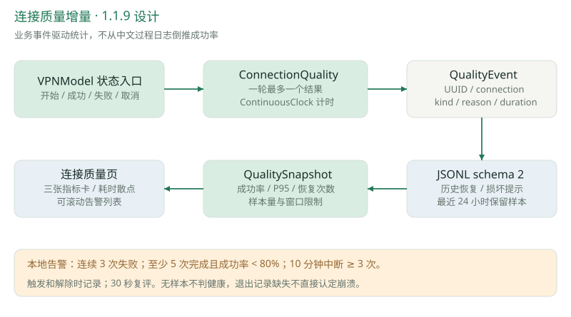

### 19.1 从过程日志到可计算的质量事件

新增 ConnectionQuality 在 VPNModel 的业务入口产生 QualityEvent，不依赖事后解析中文日志来判断连接成功率。事件使用闭合枚举：attemptStarted/Succeeded/Failed/Cancelled、recoveryStarted/Succeeded/Failed/Cancelled、observationEnded 与 uncleanExit。reason 区分用户、退出、切网、物理离线、睡眠、传输失败、恢复超时、准备失败、认证/证书/网络配置错误及助手失联等。

每条事件具有独立 UUID、Unix 时间、connection ID、kind、可选 reason 和 durationMS。计时使用 ContinuousClock；durationMS 包含该轮期间的离线和睡眠等待。重复 connected 不重复结算成功；已建立隧道的恢复成功也不增加新登录次数。observationEnded 只表示质量计量结束，不能替代助手 stopped 和网络清理证据。

新增 `connectionID` 与用于取消任务的 generation 分离：取消任务仍可更新 generation，但随后旧隧道的清理日志沿用原连接 ID。这修正了基线日志中“尝试标识同时承担取消代次”的可追溯性限制。

### 19.2 指标与 UI 设计

侧栏新增“连接质量”页，使用原生 Swift Charts。上方三张指标卡展示成功率、成功连接耗时 P95 和恢复次数；中间用散点图展示成功样本耗时；下方列出本地告警、文件异常与历史不完整提示。页面可滚动，避免多条告警压缩布局。没有样本时显示无数据，不能显示虚假的 100% 健康。

| 指标 | 统计口径 | 解释边界 |
| --- | --- | --- |
| 连接成功率 | 成功 /（成功 + 失败） | 取消、进行中、缺少结果的尝试不进分母 |
| 连接耗时 P95 | 成功样本按耗时排序，取 ceil(0.95 × N) 的 nearest-rank | 从准备助手到隧道建立，显示样本数；不是业务请求延迟 |
| 恢复次数 | recoveryStarted 数量，另列成功与失败 | 旧会话恢复与新登录分别统计 |
| 窗口 | 最近 24 小时已保留事件 | 文件轮转可能使历史不足 24 小时 |
| 内存保留 | 运行中质量事件筛选最近 24 小时、最多 10000 条 | 不代表完整历史、设备群可用率或 SLA |
| 页面刷新 | 30 秒周期，业务事件即时触发模型评估 | 告警不是系统推送或外部消息通知 |

### 19.3 本地告警规则

| 规则 | 触发条件 | 解除条件 |
| --- | --- | --- |
| 连续失败 | 10 分钟内最后 3 次完成尝试均失败 | 成功打断或窗口样本不足 |
| 成功率偏低 | 10 分钟至少 5 次完成尝试，成功率低于 80% | 比率恢复或样本不足 |
| 频繁中断 | 10 分钟至少 3 次引擎中断或意外结束 | 窗口内数量降至阈值以下 |
| 未正常结束线索 | 最近 24 小时启动时发现上次会话缺少退出记录 | 对应检测事件移出窗口 |

同一恢复失败随后进程退出只计一次中断；主动切网、物理离线与睡眠恢复不纳入“频繁中断”。规则 ID 的集合变化驱动 alert.triggered / alert.resolved 日志，持续异常不反复刷屏。阈值是本机初始排障策略，未由线上统计校准。

### 19.4 日志 schema 与历史恢复

RollingActivityLog 新增 schemaVersion=2、build、osVersion 和可选 quality，同时增加 quality 来源。旧记录可解码，但不补造历史质量样本。启动时通过日志串行队列先读取历史、再写当前 app.started；损坏行跳过并提示，链接、特殊文件和异常大小文件拒绝读取。

历史不完整时不推断上次异常退出。即便历史完整，“缺少 app.quitting”也只是未观测到正常退出，可能来自强制结束、断电或尾部日志未持久化；它不是 crash-free sessions 指标，也无法提供堆栈根因。

仍没有业务 HTTP/DNS 探测、丢包、吞吐、可靠上传队列、集中 Dashboard 或外部消息发送。未来集中监控需先定义匿名安装标识、事件 UUID 去重、上传预算、采集缺口与告警接收方；现有轮转文件会覆盖，不能直接充当可靠消息队列。

### 19.5 本章的验证依据

观察截点的 VERIFICATION.md 新增记录称：一次完整运行 136 项通过；随后新增测试后运行质量相关定向测试 19 项通过，此时套件总数为 137。两次结果不能相加为 155，也不能表述为“最终源码一次全量 137 项通过”。记录还包含无数据、成功样本、连续失败和最小窗口 UI 检查，以及 1.1.9 Release 打包/签名验证。

这些是新增开发记录的转述，本次文档工作未独立重跑其测试，也未将其与正在变化的助手 v5 源码建立摘要绑定。实现索引：`Sources/XDVPN/ConnectionQuality.swift`、`Sources/XDVPN/QualityView.swift`、`Tests/XDVPNTests/ConnectionQualityTests.swift`，以及 VPNModel、RollingActivityLog 的增量。

## 20 开发快照：路由归属与助手诊断扩展

本章记录同一观察截点发现的助手 v5 开发代码，属于设计与接入状态说明。未将其认定为完整交付或已通过网络回归。它改变第 06、07、11、13 章中助手 v4 的部分边界，需要后续独立升级与验收，不能沿用“只更新 App，无需更新助手”的结论。

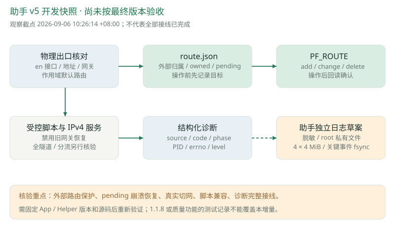

### 20.1 服务器主机路由的原生管理

新增 TunnelRoutes 使用数值 IPv4 与 PF_ROUTE 进行查找、增加、变更和删除，不通过 shell、DNS 或全局路由 flush。物理出口按 SystemConfiguration 的服务顺序选择 en 接口，核对 Active、地址、网关和该接口作用域下的默认路由，再构造 VPN 服务器的主机路由。

RouteSocket 请求携带 PID 与随机序号；非阻塞读取按二者匹配回复，使用约 1 秒响应期限和 8192 字节缓冲。路由 sockaddr 按 Darwin 的 4 字节边界处理。更新限定为非 scoped 的合法 IPv4 主机路由，带 gateway、source 与 interfaceIndex，禁止借此接口任意改写全部路由。

### 20.2 先记意图、再操作、后回读

新增私有 `route.json` 记录 processID、server、external、owned、pending。外部已有主机路由不会被自动认领；只有出口、源地址与网关匹配时才保留使用，否则报归属/出口冲突。

对本次自有路由，先持久化 pending 目标，再执行 add/change，随后查回确认匹配，最后将 pending 转为 owned。删除也只针对 owned/pending 能匹配的服务器主机路由，并查回确认；这让变更前后的崩溃窗口具有可解释的记录。路由记录与隧道记录共享私有目录及锁生命周期。

开发代码同时生成会话内 `vpnc-managed-script`，在识别到脚本的固定主段标记时覆盖服务器 IPv4 路由与默认路由相关函数，将服务器路由交由 PF_ROUTE 管理，避免恢复旧 Wi-Fi 保存的默认网关。常规隧道、DNS 与 split route 仍复用原脚本。首次配置后新增 IPv4 服务写入与回读，按 CISCO_SPLIT_INC 判断是否设置全隧道的 Router/OverridePrimary。

这条路径新增了对 vpnc-script 文本结构和 macOS 路由消息的依赖。必须验证脚本版本变化、同址网关切换、外部路由冲突、pending 时崩溃、删除复核、全隧道/分流与遗留记录升级；不能仅因已有 Swift 代码就宣称已解决实际路由故障。

### 20.3 助手诊断的开发方向

新增 EngineDiagnostic 包含 source、code、phase、processID、errorNumber、level，HelperEvent 新增可选 diagnostic。传输错误分类扩展到 EADDRNOTAVAIL 等已知错误。脚本包装器新增 begin/exited/timeout、路由变更前后与原生复核诊断。

DiagnosticSanitizer 草案对认证标记正文、已知敏感值、认证字段与 URL 参数进行省略或替换，并限制单行长度。HelperDiagnosticLog 草案写入 `/Library/Logs/XD VPN/helper-<uid>/`，默认 4 × 4 MiB，root 私有权限、相对目录 FD 操作、关键终止/错误事件 fsync；目标是让 App 退出后的助手清理也有独立证据。

在本章观察截点，诊断类型和日志组件已经出现，但未在当时的 TunnelEngine/main.swift 中观察到完整实例化与每行写入接线。因此“助手独立日志已生效”“所有 DTLS 失败可查”“逐行脱敏已覆盖全部输出”都不能作为完成结论。新增采集路径需要独立隐私回归、故障注入和 App/Helper 协议兼容检查。

### 20.4 文档与实现交接

| 项目 | 截点状态 | 后续核验 |
| --- | --- | --- |
| 助手版本 | PrivilegePolicy 已改为 5 | 新旧助手兼容、安装升级与实际打包版本 |
| 路由管理 | 新类与脚本包装调用已出现 | 编译、路由消息、归属冲突、回读与真实切网 |
| 原生 IPv4 服务 | connect 后新增配置/回读路径 | 全隧道/分流、configd 行为、与原有清理组合 |
| 助手诊断 | 类型、脱敏器、日志类及部分诊断输出已出现 | 完整接线、退出后可读证据、敏感值排除 |
| 与 1.1.9 质量功能组合 | 同工作区并行修改，版本声明存在差异 | 固定最终源码摘要、App/Helper 版本和一套组合验证结果 |

实现索引：`Sources/VPNCore/TunnelRoutes.swift`、`Sources/VPNCore/EngineDiagnostics.swift`，以及 TunnelNetworkSession、NetworkScriptRunner、Messages、PrivilegePolicy 的开发增量。后续正式交付后，应将已核验的增量合并进对应主章节，并替换本章的开发状态说明。
